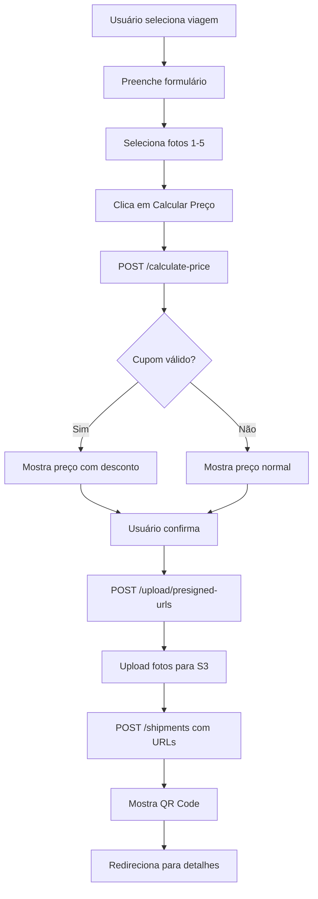

# 📱 Especificação Completa - App Mobile NavegaJá
## Sistema de Encomendas (Shipments)

> **Versão:** 1.0
> **Última atualização:** 2026-02-13
> **Backend:** 100% implementado e pronto para integração

---

## 📋 Índice

1. [Overview do Sistema](#overview-do-sistema)
2. [Tipos TypeScript](#tipos-typescript)
3. [Endpoints da API](#endpoints-da-api)
4. [Fluxos de Usuário](#fluxos-de-usuário)
5. [Upload de Fotos](#upload-de-fotos)
6. [Validações Client-Side](#validações-client-side)
7. [Tratamento de Erros](#tratamento-de-erros)
8. [Componentes Necessários](#componentes-necessários)
9. [Exemplos de Código](#exemplos-de-código)
10. [Checklist de Implementação](#checklist-de-implementação)

---

## 🎯 Overview do Sistema

### O que o usuário pode fazer?

1. **Calcular preço** da encomenda antes de criar (preview)
2. **Criar encomenda** com fotos, dados do destinatário e cupom de desconto
3. **Listar** suas encomendas (histórico)
4. **Ver detalhes** de uma encomenda (QR Code, timeline, status)
5. **Rastrear** encomenda por código (público)
6. **Cancelar** encomenda (se ainda não foi entregue)
7. **Avaliar** encomenda após entrega

### Funcionalidades Especiais

- ✅ **Peso volumétrico**: cobra pelo maior entre peso real e volumétrico
- ✅ **Cupons inteligentes**: validação por datas, rota e peso
- ✅ **QR Code**: gerado automaticamente para rastreamento
- ✅ **Timeline**: histórico completo de eventos
- ✅ **Fotos**: até 5 fotos por encomenda (upload direto S3)
- ✅ **Avaliação tripla**: rating geral, qualidade, pontualidade

---

## 📦 Tipos TypeScript

```typescript
// ========================================
// ENUMS
// ========================================

export enum ShipmentStatus {
  PENDING = 'pending',         // Aguardando confirmação de pagamento
  IN_TRANSIT = 'in_transit',   // Em trânsito no barco
  DELIVERED = 'delivered',     // Entregue ao destinatário
  CANCELLED = 'cancelled',     // Cancelada
}

export enum PaymentMethod {
  PIX = 'pix',
  CREDIT_CARD = 'credit_card',
  DEBIT_CARD = 'debit_card',
  CASH = 'cash',
}

// ========================================
// ENTITIES
// ========================================

export interface Shipment {
  id: string;
  trackingCode: string;              // Ex: "NJ2026000123"
  qrCode: string;                    // Base64 data URL
  status: ShipmentStatus;

  // Remetente
  senderId: string;
  sender?: User;

  // Destinatário
  recipientName: string;
  recipientPhone: string;
  recipientAddress: string;

  // Encomenda
  description: string;
  weightKg: number;                  // Peso real em kg
  length?: number;                   // Comprimento em cm
  width?: number;                    // Largura em cm
  height?: number;                   // Altura em cm
  photos: string[];                  // URLs das fotos

  // Viagem
  tripId: string;
  trip?: Trip;

  // Pagamento
  totalPrice: number;
  paymentMethod: PaymentMethod;
  paymentStatus?: string;

  // Entrega
  deliveredAt?: string;
  deliveryPhotoUrl?: string;

  // Datas
  createdAt: string;
  updatedAt: string;
}

export interface ShipmentTimeline {
  id: string;
  shipmentId: string;
  status: string;
  description: string;
  location?: string;
  createdBy?: string;
  createdAt: string;
}

export interface ShipmentReview {
  id: string;
  shipmentId: string;
  senderId: string;
  sender?: User;
  rating: number;                    // 1-5 estrelas (geral)
  deliveryQuality: number;           // 1-5 (qualidade)
  timeliness: number;                // 1-5 (pontualidade)
  comment?: string;
  createdAt: string;
}

export interface Trip {
  id: string;
  origin: string;
  destination: string;
  departureAt: string;
  arrivalAt?: string;
  status: string;
  cargoPriceKg: number;              // Preço por kg de carga
  boat?: Boat;
  route?: Route;
}

// ========================================
// DTOs (Request/Response)
// ========================================

export interface CalculatePriceRequest {
  tripId: string;
  weightKg: number;
  length?: number;                   // Opcional
  width?: number;
  height?: number;
  couponCode?: string;               // Opcional
}

export interface CalculatePriceResponse {
  basePrice: number;
  volumetricWeight?: number;
  actualWeight: number;
  chargedWeight: number;
  pricePerKg: number;
  weightCharge: number;
  couponDiscount: number;
  couponCode?: string;
  totalDiscount: number;
  finalPrice: number;
}

export interface CreateShipmentRequest {
  tripId: string;
  description: string;
  weightKg: number;
  length?: number;
  width?: number;
  height?: number;
  photos: string[];                  // URLs (após upload)
  recipientName: string;
  recipientPhone: string;
  recipientAddress: string;
  paymentMethod: PaymentMethod;
  couponCode?: string;
}

export interface CreateReviewRequest {
  shipmentId: string;
  rating: number;                    // 1-5
  deliveryQuality: number;           // 1-5
  timeliness: number;                // 1-5
  comment?: string;
}

export interface GeneratePresignedUrlsRequest {
  count: number;                     // 1-5 fotos
}

export interface PresignedUrl {
  uploadUrl: string;                 // URL para fazer PUT
  publicUrl: string;                 // URL pública após upload
  key: string;                       // Chave no S3
}

export interface GeneratePresignedUrlsResponse {
  urls: PresignedUrl[];
  expiresIn: number;                 // Segundos (300 = 5min)
}

export interface TrackResponse {
  shipment: Shipment;
  timeline: ShipmentTimeline[];
}
```

---

## 🔌 Endpoints da API

### Base URL
```
https://api.navegaja.com.br
```

### Autenticação
Todos os endpoints (exceto rastreamento público) requerem JWT:
```
Authorization: Bearer {token}
```

---

### 1️⃣ POST `/shipments/calculate-price`
**Calcula preço antes de criar a encomenda**

```typescript
// Request
POST /shipments/calculate-price
Headers: { Authorization: Bearer {token} }
Body: {
  "tripId": "uuid-da-viagem",
  "weightKg": 5.5,
  "length": 30,      // Opcional
  "width": 20,
  "height": 15,
  "couponCode": "FRETE10"  // Opcional
}

// Response 200
{
  "basePrice": 66.00,
  "volumetricWeight": 1.5,
  "actualWeight": 5.5,
  "chargedWeight": 5.5,
  "pricePerKg": 12.00,
  "weightCharge": 66.00,
  "couponDiscount": 6.60,
  "couponCode": "FRETE10",
  "totalDiscount": 6.60,
  "finalPrice": 59.40
}

// Errors
404 - Viagem não encontrada
400 - Viagem não aceita encomendas (cargoPriceKg = 0)
```

---

### 2️⃣ POST `/shipments/upload/presigned-urls`
**Gera URLs para upload de fotos no S3**

```typescript
// Request
POST /shipments/upload/presigned-urls
Headers: { Authorization: Bearer {token} }
Body: {
  "count": 3  // Número de fotos (1-5)
}

// Response 200
{
  "urls": [
    {
      "uploadUrl": "https://navegaja-shipments.s3.amazonaws.com/...",
      "publicUrl": "https://navegaja-shipments.s3.amazonaws.com/shipments/2026/uuid1.jpg",
      "key": "shipments/2026/uuid1.jpg"
    },
    {
      "uploadUrl": "https://...",
      "publicUrl": "https://.../uuid2.jpg",
      "key": "shipments/2026/uuid2.jpg"
    }
  ],
  "expiresIn": 300  // 5 minutos
}

// Errors
400 - Count inválido (deve ser 1-5)
```

**Como fazer upload:**
```typescript
// Frontend faz PUT direto no S3
const response = await fetch(uploadUrl, {
  method: 'PUT',
  body: imageFile,
  headers: { 'Content-Type': 'image/jpeg' }
});

// Depois usa a publicUrl ao criar a encomenda
```

---

### 3️⃣ POST `/shipments`
**Criar nova encomenda**

```typescript
// Request
POST /shipments
Headers: { Authorization: Bearer {token} }
Body: {
  "tripId": "uuid-da-viagem",
  "description": "Caixa com roupas e alimentos",
  "weightKg": 5.5,
  "length": 30,
  "width": 20,
  "height": 15,
  "photos": [
    "https://navegaja-shipments.s3.amazonaws.com/shipments/2026/uuid1.jpg",
    "https://navegaja-shipments.s3.amazonaws.com/shipments/2026/uuid2.jpg"
  ],
  "recipientName": "Maria Santos",
  "recipientPhone": "92998765432",
  "recipientAddress": "Rua das Flores, 123 - Centro, Parintins-AM",
  "paymentMethod": "pix",
  "couponCode": "FRETE10"
}

// Response 200
{
  "id": "uuid-encomenda",
  "trackingCode": "NJ2026000123",
  "qrCode": "data:image/png;base64,iVBORw0KGg...",
  "status": "pending",
  "senderId": "uuid-usuario",
  "recipientName": "Maria Santos",
  "recipientPhone": "92998765432",
  "recipientAddress": "Rua das Flores, 123 - Centro, Parintins-AM",
  "description": "Caixa com roupas e alimentos",
  "weightKg": 5.5,
  "length": 30,
  "width": 20,
  "height": 15,
  "photos": ["https://..."],
  "tripId": "uuid-da-viagem",
  "totalPrice": 59.40,
  "paymentMethod": "pix",
  "createdAt": "2026-02-13T10:00:00Z",
  "updatedAt": "2026-02-13T10:00:00Z"
}

// Errors
404 - Viagem não encontrada
400 - Peso inválido (0.1-50kg)
400 - Dimensões inválidas (1-200cm)
400 - Máximo de 5 fotos permitidas
```

---

### 4️⃣ GET `/shipments/my-shipments`
**Listar encomendas do usuário**

```typescript
// Request
GET /shipments/my-shipments
Headers: { Authorization: Bearer {token} }

// Response 200
[
  {
    "id": "uuid-1",
    "trackingCode": "NJ2026000123",
    "status": "in_transit",
    "recipientName": "Maria Santos",
    "description": "Caixa com roupas",
    "weightKg": 5.5,
    "totalPrice": 59.40,
    "createdAt": "2026-02-13T10:00:00Z",
    "trip": {
      "id": "uuid-trip",
      "origin": "Manaus",
      "destination": "Parintins",
      "departureAt": "2026-02-15T08:00:00Z",
      "status": "in_progress",
      "boat": {
        "id": "uuid-boat",
        "name": "Capitão Silva"
      }
    }
  }
]

// Ordenado por createdAt DESC (mais recente primeiro)
```

---

### 5️⃣ GET `/shipments/:id`
**Detalhes completos da encomenda**

```typescript
// Request
GET /shipments/{id}
Headers: { Authorization: Bearer {token} }

// Response 200
{
  "id": "uuid-encomenda",
  "trackingCode": "NJ2026000123",
  "qrCode": "data:image/png;base64,...",
  "status": "in_transit",
  "senderId": "uuid-usuario",
  "sender": {
    "id": "uuid",
    "name": "João Silva",
    "profilePicture": "https://..."
  },
  "recipientName": "Maria Santos",
  "recipientPhone": "92998765432",
  "recipientAddress": "Rua das Flores, 123",
  "description": "Caixa com roupas e alimentos",
  "weightKg": 5.5,
  "length": 30,
  "width": 20,
  "height": 15,
  "photos": ["https://...", "https://..."],
  "tripId": "uuid-trip",
  "trip": {
    "id": "uuid-trip",
    "origin": "Manaus",
    "destination": "Parintins",
    "departureAt": "2026-02-15T08:00:00Z",
    "arrivalAt": "2026-02-18T14:00:00Z",
    "status": "in_progress",
    "boat": {
      "name": "Capitão Silva",
      "registration": "AM-1234"
    },
    "captain": {
      "name": "José Silva",
      "phone": "92999887766"
    }
  },
  "totalPrice": 59.40,
  "paymentMethod": "pix",
  "paymentStatus": "paid",
  "createdAt": "2026-02-13T10:00:00Z",
  "updatedAt": "2026-02-15T08:30:00Z"
}

// Errors
404 - Encomenda não encontrada
403 - Você não tem permissão (não é o dono nem capitão)
```

---

### 6️⃣ GET `/shipments/:id/timeline`
**Timeline de eventos da encomenda**

```typescript
// Request
GET /shipments/{id}/timeline
Headers: { Authorization: Bearer {token} }

// Response 200
[
  {
    "id": "uuid-event-1",
    "shipmentId": "uuid-encomenda",
    "status": "pending",
    "description": "Encomenda criada e aguardando confirmação de pagamento",
    "location": null,
    "createdBy": null,
    "createdAt": "2026-02-13T10:00:00Z"
  },
  {
    "id": "uuid-event-2",
    "shipmentId": "uuid-encomenda",
    "status": "in_transit",
    "description": "Encomenda em trânsito",
    "location": "Manaus - AM",
    "createdBy": "uuid-captain",
    "createdAt": "2026-02-15T08:30:00Z"
  },
  {
    "id": "uuid-event-3",
    "shipmentId": "uuid-encomenda",
    "status": "delivered",
    "description": "Encomenda entregue ao destinatário",
    "location": "Parintins - AM",
    "createdBy": "uuid-captain",
    "createdAt": "2026-02-18T14:00:00Z"
  }
]

// Ordenado por createdAt ASC (cronológico)
```

---

### 7️⃣ GET `/shipments/track/:code` (PÚBLICO)
**Rastrear encomenda por código**

```typescript
// Request (SEM autenticação!)
GET /shipments/track/NJ2026000123

// Response 200
{
  "shipment": {
    "id": "uuid-encomenda",
    "trackingCode": "NJ2026000123",
    "status": "in_transit",
    "recipientName": "Maria S.",  // Nome truncado por privacidade
    "description": "Caixa com roupas",
    "weightKg": 5.5,
    "trip": {
      "origin": "Manaus",
      "destination": "Parintins",
      "departureAt": "2026-02-15T08:00:00Z"
    },
    "createdAt": "2026-02-13T10:00:00Z"
  },
  "timeline": [
    {
      "status": "pending",
      "description": "Encomenda criada",
      "createdAt": "2026-02-13T10:00:00Z"
    },
    {
      "status": "in_transit",
      "description": "Em trânsito",
      "location": "Manaus - AM",
      "createdAt": "2026-02-15T08:30:00Z"
    }
  ]
}

// Errors
404 - Código de rastreamento não encontrado
```

---

### 8️⃣ POST `/shipments/:id/cancel`
**Cancelar encomenda**

```typescript
// Request
POST /shipments/{id}/cancel
Headers: { Authorization: Bearer {token} }
Body: {
  "reason": "Mudei de ideia"  // Opcional
}

// Response 200
{
  "id": "uuid-encomenda",
  "status": "cancelled",
  "updatedAt": "2026-02-13T11:00:00Z"
  // ... resto dos campos
}

// Errors
404 - Encomenda não encontrada
403 - Você não tem permissão
400 - Não é possível cancelar (já entregue ou já cancelada)
```

---

### 9️⃣ POST `/shipments/reviews`
**Criar avaliação**

```typescript
// Request
POST /shipments/reviews
Headers: { Authorization: Bearer {token} }
Body: {
  "shipmentId": "uuid-encomenda",
  "rating": 5,               // 1-5 (rating geral)
  "deliveryQuality": 5,      // 1-5 (qualidade da entrega)
  "timeliness": 4,           // 1-5 (pontualidade)
  "comment": "Entrega perfeita, muito cuidadosa!"
}

// Response 200
{
  "id": "uuid-review",
  "shipmentId": "uuid-encomenda",
  "senderId": "uuid-usuario",
  "rating": 5,
  "deliveryQuality": 5,
  "timeliness": 4,
  "comment": "Entrega perfeita!",
  "createdAt": "2026-02-18T15:00:00Z"
}

// Errors
404 - Encomenda não encontrada
400 - Só é possível avaliar encomendas entregues
400 - Esta encomenda já foi avaliada
```

---

### 🔟 GET `/shipments/:id/review`
**Buscar avaliação existente**

```typescript
// Request
GET /shipments/{id}/review
Headers: { Authorization: Bearer {token} }

// Response 200
{
  "id": "uuid-review",
  "shipmentId": "uuid-encomenda",
  "senderId": "uuid-usuario",
  "sender": {
    "id": "uuid",
    "name": "João Silva",
    "profilePicture": "https://..."
  },
  "rating": 5,
  "deliveryQuality": 5,
  "timeliness": 4,
  "comment": "Entrega perfeita!",
  "createdAt": "2026-02-18T15:00:00Z"
}

// Response 200 (se não existe)
null

// Errors
404 - Encomenda não encontrada
```

---

## 🚀 Fluxos de Usuário

### Fluxo 1: Criar Nova Encomenda



**Código exemplo:**

```typescript
// 1. Calcular preço
const priceCalc = await api.post('/shipments/calculate-price', {
  tripId: selectedTrip.id,
  weightKg: formData.weight,
  length: formData.length,
  width: formData.width,
  height: formData.height,
  couponCode: formData.couponCode,
});

// Mostrar preview
showPricePreview(priceCalc.data);

// 2. Usuário confirma - upload fotos
const { urls } = await api.post('/shipments/upload/presigned-urls', {
  count: photos.length
});

const uploadedUrls = [];
for (let i = 0; i < photos.length; i++) {
  await fetch(urls[i].uploadUrl, {
    method: 'PUT',
    body: photos[i],
    headers: { 'Content-Type': 'image/jpeg' }
  });
  uploadedUrls.push(urls[i].publicUrl);
}

// 3. Criar encomenda
const shipment = await api.post('/shipments', {
  ...formData,
  photos: uploadedUrls
});

// Mostrar QR Code
navigation.navigate('ShipmentDetails', { id: shipment.data.id });
```

---

### Fluxo 2: Ver Minhas Encomendas

```typescript
// Listar encomendas
const { data } = await api.get('/shipments/my-shipments');

// Renderizar lista
<FlatList
  data={data}
  keyExtractor={item => item.id}
  renderItem={({ item }) => (
    <ShipmentCard
      trackingCode={item.trackingCode}
      status={item.status}
      recipient={item.recipientName}
      destination={item.trip.destination}
      price={item.totalPrice}
      onPress={() => navigation.navigate('Details', { id: item.id })}
    />
  )}
/>
```

---

### Fluxo 3: Ver Detalhes + Timeline

```typescript
// Buscar detalhes
const [shipment, timeline] = await Promise.all([
  api.get(`/shipments/${id}`),
  api.get(`/shipments/${id}/timeline`)
]);

// Renderizar
<ShipmentDetails
  shipment={shipment.data}
  timeline={timeline.data}
  onCancel={handleCancel}
  onReview={handleReview}
/>
```

---

### Fluxo 4: Rastrear por Código (Público)

```typescript
// Input do código
const [code, setCode] = useState('');

// Buscar (SEM autenticação)
const track = async () => {
  try {
    const { data } = await axios.get(`https://api.navegaja.com.br/shipments/track/${code}`);
    setResult(data);
  } catch (error) {
    showError('Código não encontrado');
  }
};

// Renderizar
<TrackingResult
  shipment={result.shipment}
  timeline={result.timeline}
/>
```

---

### Fluxo 5: Cancelar Encomenda

```typescript
const handleCancel = async (shipmentId: string) => {
  Alert.alert(
    'Cancelar Encomenda',
    'Tem certeza que deseja cancelar?',
    [
      { text: 'Não', style: 'cancel' },
      {
        text: 'Sim',
        onPress: async () => {
          await api.post(`/shipments/${shipmentId}/cancel`, {
            reason: 'Mudei de ideia'
          });
          navigation.goBack();
        }
      }
    ]
  );
};
```

---

### Fluxo 6: Avaliar Encomenda

```typescript
// Verificar se já foi avaliada
const existingReview = await api.get(`/shipments/${shipmentId}/review`);
if (existingReview.data) {
  showError('Você já avaliou esta encomenda');
  return;
}

// Criar avaliação
await api.post('/shipments/reviews', {
  shipmentId,
  rating: 5,
  deliveryQuality: 5,
  timeliness: 4,
  comment: 'Excelente!'
});

showSuccess('Avaliação enviada com sucesso!');
```

---

## 📸 Upload de Fotos (Detalhado)

### Opção 1: Presigned URLs (Recomendado)

```typescript
import { launchImageLibrary } from 'react-native-image-picker';
import axios from 'axios';

const uploadPhotos = async (selectedImages: Asset[]) => {
  try {
    // 1. Solicitar presigned URLs
    const { data } = await api.post('/shipments/upload/presigned-urls', {
      count: selectedImages.length
    });

    // 2. Upload cada foto para S3
    const uploadedUrls: string[] = [];

    for (let i = 0; i < selectedImages.length; i++) {
      const image = selectedImages[i];
      const { uploadUrl, publicUrl } = data.urls[i];

      // Ler arquivo como blob
      const blob = await fetch(image.uri).then(r => r.blob());

      // Upload direto para S3 (PUT request)
      await axios.put(uploadUrl, blob, {
        headers: {
          'Content-Type': 'image/jpeg',
        },
        onUploadProgress: (progressEvent) => {
          const progress = (progressEvent.loaded / progressEvent.total) * 100;
          console.log(`Upload ${i + 1}: ${progress}%`);
        }
      });

      uploadedUrls.push(publicUrl);
    }

    return uploadedUrls;

  } catch (error) {
    console.error('Upload error:', error);
    throw error;
  }
};

// Uso
const handleSelectPhotos = async () => {
  const result = await launchImageLibrary({
    mediaType: 'photo',
    selectionLimit: 5,
    quality: 0.8,
  });

  if (result.assets) {
    setUploading(true);
    const urls = await uploadPhotos(result.assets);
    setPhotoUrls(urls);
    setUploading(false);
  }
};
```

---

## ✅ Validações Client-Side

### Formulário de Criação

```typescript
const validateShipment = (formData: any): string[] => {
  const errors: string[] = [];

  // Peso
  if (!formData.weightKg || formData.weightKg < 0.1 || formData.weightKg > 50) {
    errors.push('Peso deve estar entre 0.1kg e 50kg');
  }

  // Dimensões (se fornecidas)
  if (formData.length && (formData.length < 1 || formData.length > 200)) {
    errors.push('Comprimento deve estar entre 1cm e 200cm');
  }
  if (formData.width && (formData.width < 1 || formData.width > 200)) {
    errors.push('Largura deve estar entre 1cm e 200cm');
  }
  if (formData.height && (formData.height < 1 || formData.height > 200)) {
    errors.push('Altura deve estar entre 1cm e 200cm');
  }

  // Fotos
  if (formData.photos.length === 0) {
    errors.push('Adicione pelo menos 1 foto');
  }
  if (formData.photos.length > 5) {
    errors.push('Máximo de 5 fotos permitidas');
  }

  // Destinatário
  if (!formData.recipientName || formData.recipientName.trim().length < 3) {
    errors.push('Nome do destinatário deve ter pelo menos 3 caracteres');
  }
  if (!formData.recipientPhone || !/^\d{10,11}$/.test(formData.recipientPhone.replace(/\D/g, ''))) {
    errors.push('Telefone inválido (10-11 dígitos)');
  }
  if (!formData.recipientAddress || formData.recipientAddress.trim().length < 10) {
    errors.push('Endereço deve ter pelo menos 10 caracteres');
  }

  // Descrição
  if (!formData.description || formData.description.trim().length < 5) {
    errors.push('Descrição deve ter pelo menos 5 caracteres');
  }

  return errors;
};

// Uso
const handleSubmit = async () => {
  const errors = validateShipment(formData);
  if (errors.length > 0) {
    Alert.alert('Erro', errors.join('\n'));
    return;
  }

  // Prosseguir com criação
  await createShipment(formData);
};
```

---

## ⚠️ Tratamento de Erros

```typescript
const handleApiError = (error: any) => {
  if (error.response) {
    // Erro com resposta do servidor
    const { status, data } = error.response;

    switch (status) {
      case 400:
        Alert.alert('Erro', data.message || 'Dados inválidos');
        break;
      case 401:
        Alert.alert('Não autorizado', 'Faça login novamente');
        navigation.navigate('Login');
        break;
      case 403:
        Alert.alert('Acesso negado', 'Você não tem permissão');
        break;
      case 404:
        Alert.alert('Não encontrado', data.message || 'Recurso não encontrado');
        break;
      case 500:
        Alert.alert('Erro no servidor', 'Tente novamente mais tarde');
        break;
      default:
        Alert.alert('Erro', 'Algo deu errado');
    }
  } else if (error.request) {
    // Sem resposta do servidor
    Alert.alert('Sem conexão', 'Verifique sua internet');
  } else {
    // Erro ao configurar request
    Alert.alert('Erro', error.message);
  }
};

// Uso em todos os requests
try {
  const response = await api.post('/shipments', data);
  // Sucesso
} catch (error) {
  handleApiError(error);
}
```

---

## 🎨 Componentes Necessários

### 1. ShipmentCard (Lista)

```typescript
interface ShipmentCardProps {
  shipment: Shipment;
  onPress: () => void;
}

const ShipmentCard: React.FC<ShipmentCardProps> = ({ shipment, onPress }) => {
  return (
    <TouchableOpacity onPress={onPress} style={styles.card}>
      <View style={styles.header}>
        <Text style={styles.trackingCode}>{shipment.trackingCode}</Text>
        <StatusBadge status={shipment.status} />
      </View>

      <Text style={styles.recipient}>
        Para: {shipment.recipientName}
      </Text>

      <View style={styles.route}>
        <Icon name="location" />
        <Text>{shipment.trip.destination}</Text>
      </View>

      <View style={styles.footer}>
        <Text style={styles.price}>R$ {shipment.totalPrice.toFixed(2)}</Text>
        <Text style={styles.date}>
          {formatDate(shipment.createdAt)}
        </Text>
      </View>
    </TouchableOpacity>
  );
};
```

---

### 2. StatusBadge

```typescript
const StatusBadge: React.FC<{ status: ShipmentStatus }> = ({ status }) => {
  const config = {
    pending: { label: 'Pendente', color: '#FFA500' },
    in_transit: { label: 'Em trânsito', color: '#2196F3' },
    delivered: { label: 'Entregue', color: '#4CAF50' },
    cancelled: { label: 'Cancelada', color: '#F44336' },
  };

  const { label, color } = config[status];

  return (
    <View style={[styles.badge, { backgroundColor: color }]}>
      <Text style={styles.badgeText}>{label}</Text>
    </View>
  );
};
```

---

### 3. Timeline Component

```typescript
interface TimelineProps {
  events: ShipmentTimeline[];
}

const Timeline: React.FC<TimelineProps> = ({ events }) => {
  return (
    <View style={styles.timeline}>
      {events.map((event, index) => (
        <View key={event.id} style={styles.timelineItem}>
          <View style={styles.timelineDot}>
            <View style={[
              styles.dot,
              index === events.length - 1 && styles.dotActive
            ]} />
            {index < events.length - 1 && <View style={styles.line} />}
          </View>

          <View style={styles.timelineContent}>
            <Text style={styles.timelineDescription}>
              {event.description}
            </Text>
            {event.location && (
              <Text style={styles.timelineLocation}>
                📍 {event.location}
              </Text>
            )}
            <Text style={styles.timelineDate}>
              {formatDateTime(event.createdAt)}
            </Text>
          </View>
        </View>
      ))}
    </View>
  );
};
```

---

### 4. QRCode Display

```typescript
import QRCode from 'react-native-qrcode-svg';

const QRCodeDisplay: React.FC<{ shipment: Shipment }> = ({ shipment }) => {
  return (
    <View style={styles.qrContainer}>
      <QRCode
        value={shipment.trackingCode}
        size={200}
        backgroundColor="white"
      />
      <Text style={styles.trackingCode}>{shipment.trackingCode}</Text>
      <TouchableOpacity onPress={() => shareQRCode(shipment.trackingCode)}>
        <Text style={styles.shareButton}>Compartilhar</Text>
      </TouchableOpacity>
    </View>
  );
};
```

---

### 5. Review Stars

```typescript
interface StarRatingProps {
  rating: number;
  onChange?: (rating: number) => void;
  editable?: boolean;
}

const StarRating: React.FC<StarRatingProps> = ({
  rating,
  onChange,
  editable = false
}) => {
  return (
    <View style={styles.stars}>
      {[1, 2, 3, 4, 5].map(star => (
        <TouchableOpacity
          key={star}
          disabled={!editable}
          onPress={() => onChange?.(star)}
        >
          <Icon
            name={star <= rating ? 'star' : 'star-outline'}
            size={32}
            color={star <= rating ? '#FFD700' : '#CCCCCC'}
          />
        </TouchableOpacity>
      ))}
    </View>
  );
};
```

---

### 6. Price Calculator Preview

```typescript
interface PricePreviewProps {
  calculation: CalculatePriceResponse;
}

const PricePreview: React.FC<PricePreviewProps> = ({ calculation }) => {
  return (
    <View style={styles.pricePreview}>
      <Text style={styles.title}>Resumo do Preço</Text>

      <Row label="Peso cobrado" value={`${calculation.chargedWeight}kg`} />
      {calculation.volumetricWeight && (
        <Row
          label="Peso volumétrico"
          value={`${calculation.volumetricWeight.toFixed(2)}kg`}
          info="Calculado pelas dimensões"
        />
      )}

      <Divider />

      <Row label="Preço base" value={formatMoney(calculation.basePrice)} />

      {calculation.couponDiscount > 0 && (
        <Row
          label={`Cupom ${calculation.couponCode}`}
          value={`-${formatMoney(calculation.couponDiscount)}`}
          highlight="green"
        />
      )}

      <Divider />

      <Row
        label="Total"
        value={formatMoney(calculation.finalPrice)}
        bold
      />
    </View>
  );
};
```

---

## 📱 Exemplo de Código Completo

### CreateShipmentScreen.tsx

```typescript
import React, { useState } from 'react';
import { View, ScrollView, TextInput, Button, Alert } from 'react-native';
import { launchImageLibrary } from 'react-native-image-picker';
import api from '../services/api';

const CreateShipmentScreen: React.FC = ({ route, navigation }) => {
  const { trip } = route.params;

  const [formData, setFormData] = useState({
    tripId: trip.id,
    description: '',
    weightKg: '',
    length: '',
    width: '',
    height: '',
    recipientName: '',
    recipientPhone: '',
    recipientAddress: '',
    paymentMethod: 'pix',
    couponCode: '',
  });

  const [photos, setPhotos] = useState<string[]>([]);
  const [priceCalc, setPriceCalc] = useState<any>(null);
  const [loading, setLoading] = useState(false);

  // Calcular preço
  const handleCalculatePrice = async () => {
    try {
      const { data } = await api.post('/shipments/calculate-price', {
        tripId: formData.tripId,
        weightKg: parseFloat(formData.weightKg),
        length: formData.length ? parseFloat(formData.length) : undefined,
        width: formData.width ? parseFloat(formData.width) : undefined,
        height: formData.height ? parseFloat(formData.height) : undefined,
        couponCode: formData.couponCode || undefined,
      });
      setPriceCalc(data);
    } catch (error) {
      Alert.alert('Erro', 'Não foi possível calcular o preço');
    }
  };

  // Selecionar fotos
  const handleSelectPhotos = async () => {
    const result = await launchImageLibrary({
      mediaType: 'photo',
      selectionLimit: 5,
      quality: 0.8,
    });

    if (result.assets && result.assets.length > 0) {
      setLoading(true);
      try {
        // Gerar presigned URLs
        const { data } = await api.post('/shipments/upload/presigned-urls', {
          count: result.assets.length
        });

        // Upload fotos
        const uploadedUrls = [];
        for (let i = 0; i < result.assets.length; i++) {
          const image = result.assets[i];
          const { uploadUrl, publicUrl } = data.urls[i];

          const blob = await fetch(image.uri).then(r => r.blob());
          await fetch(uploadUrl, {
            method: 'PUT',
            body: blob,
            headers: { 'Content-Type': 'image/jpeg' }
          });

          uploadedUrls.push(publicUrl);
        }

        setPhotos(uploadedUrls);
      } catch (error) {
        Alert.alert('Erro', 'Falha ao enviar fotos');
      } finally {
        setLoading(false);
      }
    }
  };

  // Criar encomenda
  const handleSubmit = async () => {
    if (photos.length === 0) {
      Alert.alert('Erro', 'Adicione pelo menos 1 foto');
      return;
    }

    setLoading(true);
    try {
      const { data } = await api.post('/shipments', {
        ...formData,
        weightKg: parseFloat(formData.weightKg),
        length: formData.length ? parseFloat(formData.length) : undefined,
        width: formData.width ? parseFloat(formData.width) : undefined,
        height: formData.height ? parseFloat(formData.height) : undefined,
        photos,
      });

      Alert.alert('Sucesso!', 'Encomenda criada com sucesso', [
        {
          text: 'Ver detalhes',
          onPress: () => navigation.replace('ShipmentDetails', { id: data.id })
        }
      ]);
    } catch (error) {
      Alert.alert('Erro', 'Falha ao criar encomenda');
    } finally {
      setLoading(false);
    }
  };

  return (
    <ScrollView>
      <TextInput
        placeholder="Descrição da encomenda"
        value={formData.description}
        onChangeText={text => setFormData({ ...formData, description: text })}
      />

      <TextInput
        placeholder="Peso (kg)"
        keyboardType="decimal-pad"
        value={formData.weightKg}
        onChangeText={text => setFormData({ ...formData, weightKg: text })}
      />

      {/* ... outros campos ... */}

      <Button title="Adicionar Fotos" onPress={handleSelectPhotos} />
      <Text>{photos.length} fotos selecionadas</Text>

      <Button title="Calcular Preço" onPress={handleCalculatePrice} />

      {priceCalc && <PricePreview calculation={priceCalc} />}

      <Button
        title="Criar Encomenda"
        onPress={handleSubmit}
        disabled={loading || !priceCalc}
      />
    </ScrollView>
  );
};
```

---

## ✅ Checklist de Implementação

### MVP (Mínimo Viável)

- [ ] **Telas**
  - [ ] Lista de encomendas (`my-shipments`)
  - [ ] Criar encomenda (formulário)
  - [ ] Detalhes da encomenda
  - [ ] Rastreamento público

- [ ] **Funcionalidades Core**
  - [ ] Calcular preço antes de criar
  - [ ] Upload de fotos (presigned URLs)
  - [ ] Criar encomenda
  - [ ] Listar minhas encomendas
  - [ ] Ver detalhes + QR Code
  - [ ] Cancelar encomenda

- [ ] **Componentes**
  - [ ] ShipmentCard (lista)
  - [ ] StatusBadge
  - [ ] QRCode display
  - [ ] PricePreview

### Melhorias (Fase 2)

- [ ] **Funcionalidades Extras**
  - [ ] Timeline detalhada
  - [ ] Sistema de avaliações
  - [ ] Compartilhar QR Code
  - [ ] Notificações push (mudança de status)
  - [ ] Filtros na lista (status, data)

- [ ] **UX**
  - [ ] Loading states
  - [ ] Skeleton screens
  - [ ] Pull to refresh
  - [ ] Empty states
  - [ ] Error boundaries

- [ ] **Otimizações**
  - [ ] Cache de imagens
  - [ ] Paginação (se muitas encomendas)
  - [ ] Offline support (React Query)

---

## 🎯 Priorização

### Sprint 1 (MVP - 2 semanas)
1. Formulário de criação
2. Upload de fotos
3. Calcular preço
4. Criar encomenda
5. Lista de encomendas
6. Detalhes básicos

### Sprint 2 (Melhorias - 1 semana)
1. Timeline completa
2. QR Code compartilhável
3. Cancelamento
4. Validações completas
5. Error handling

### Sprint 3 (Polish - 1 semana)
1. Sistema de avaliações
2. Notificações push
3. Loading states
4. UX improvements
5. Testes

---

## 📞 Suporte

**Dúvidas técnicas?** Entre em contato com o time de backend! 🚀

**Endpoint de teste:**
```
https://api-dev.navegaja.com.br
```

**Swagger docs:**
```
https://api-dev.navegaja.com.br/docs
```

---

**Última atualização:** 2026-02-13
**Versão da API:** 1.0
**Status:** ✅ 100% implementado e pronto para integração
