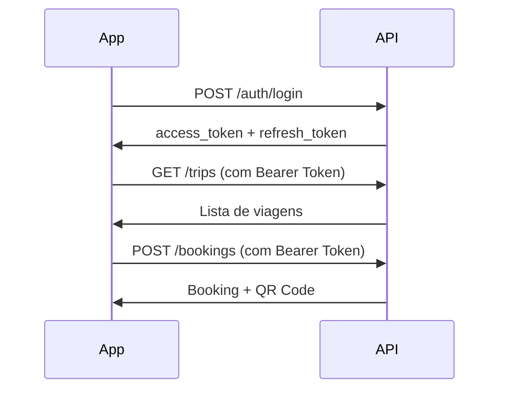

# 🚀 Quick Start - NavegaJá API

## ⚡ Início Rápido (5 minutos)

### 1️⃣ Servidor está rodando?
```bash
# Verificar se está online
curl http://localhost:3000

# Deve retornar: {"statusCode":404,"message":"Cannot GET /"}
```

✅ **Status:** Servidor ONLINE na porta 3000

---

### 2️⃣ Acessar Documentação Swagger
```
http://localhost:3000/api
```

---

### 3️⃣ Testar Endpoints Principais

#### 🔐 Login
```bash
curl -X POST http://localhost:3000/auth/login \
  -H "Content-Type: application/json" \
  -d '{
    "phone": "92991234567",
    "password": "senha123"
  }'
```

**Response:**
```json
{
  "access_token": "eyJhbGci...",
  "refresh_token": "eyJhbGci...",
  "user": { ... }
}
```

Copie o `access_token` para usar nos próximos requests!

---

#### 🚢 Buscar Viagens
```bash
TOKEN="SEU_TOKEN_AQUI"

curl -X GET "http://localhost:3000/trips?origin=Manaus&destination=Parintins" \
  -H "Authorization: Bearer $TOKEN"
```

**Response:**
```json
[
  {
    "id": "uuid",
    "origin": "Manaus",
    "destination": "Parintins",
    "departureAt": "2026-02-15T08:00:00.000Z",
    "price": 45.00,
    "availableSeats": 18,
    "boat": { ... },
    "captain": { ... }
  }
]
```

---

#### 🎫 Criar Reserva (gera QR code!)
```bash
TRIP_ID="COPIE_O_ID_DA_VIAGEM_ACIMA"

curl -X POST http://localhost:3000/bookings \
  -H "Authorization: Bearer $TOKEN" \
  -H "Content-Type: application/json" \
  -d '{
    "tripId": "'$TRIP_ID'",
    "quantity": 2,
    "paymentMethod": "pix"
  }'
```

**Response:**
```json
{
  "id": "uuid",
  "qrCode": "data:image/png;base64,iVBORw0KGgo...",
  "totalPrice": 90.00,
  "status": "confirmed"
}
```

✨ **O QR code já está em base64!** Pronto para exibir no app.

---

## 📱 Integração Frontend

### React Native (Expo)

```typescript
import axios from 'axios';

const api = axios.create({
  baseURL: 'http://localhost:3000',
});

// 1. Login
const { data } = await api.post('/auth/login', {
  phone: '92991234567',
  password: 'senha123',
});

api.defaults.headers.common['Authorization'] = `Bearer ${data.access_token}`;

// 2. Buscar viagens
const trips = await api.get('/trips', {
  params: {
    origin: 'Manaus',
    destination: 'Parintins',
    date: '2026-02-15',
  },
});

// 3. Criar reserva
const booking = await api.post('/bookings', {
  tripId: trips.data[0].id,
  quantity: 2,
  paymentMethod: 'pix',
});

// 4. Exibir QR Code
<Image
  source={{ uri: booking.data.qrCode }}
  style={{ width: 200, height: 200 }}
/>
```

---

## 🔑 Autenticação Completa

### Fluxo de Auth



### Refresh Token

```typescript
// Quando access_token expirar
const { data } = await api.post('/auth/refresh', {
  refreshToken: storedRefreshToken,
});

// Atualizar token
api.defaults.headers.common['Authorization'] = `Bearer ${data.access_token}`;
```

---

## 🎯 Endpoints Mais Usados

| Endpoint | Método | Descrição | Auth |
|----------|--------|-----------|------|
| `/auth/login` | POST | Login | Não |
| `/trips` | GET | Buscar viagens | Sim |
| `/trips/:id` | GET | Detalhes viagem | Sim |
| `/bookings` | POST | Criar reserva | Sim |
| `/bookings/my-bookings` | GET | Minhas reservas | Sim |
| `/bookings/:id/cancel` | POST | Cancelar | Sim |

---

## 🛠️ Troubleshooting

### Servidor não inicia?
```bash
# Verificar se porta 3000 está ocupada
netstat -ano | findstr :3000

# Matar processo se necessário
taskkill /PID [número] /F

# Reiniciar servidor
yarn start:dev
```

### Erro 401 Unauthorized?
- Verifique se o token está no header: `Authorization: Bearer {token}`
- Token pode ter expirado, faça refresh ou login novamente

### Erro 404 Trip not found?
- Verifique se existem viagens no banco
- Use `GET /trips` sem filtros para listar todas

### QR Code não aparece?
- Verifique se o campo `qrCode` está presente na response
- QR code é gerado automaticamente ao criar booking
- Formato: `data:image/png;base64,...`

---

## 📊 Status do Banco de Dados

Execute para verificar:
```bash
node scripts/populate-data.js
```

**Output esperado:**
```
✅ Conectado ao banco de dados
📊 Status do banco de dados:
   - Total de trips: 10
   - Total de bookings: 6
   - Trips com origin: 10
   - Bookings com QR code: 6
```

---

## 🧪 Testar com REST Client (VSCode)

1. Instalar extensão:
```bash
code --install-extension humao.rest-client
```

2. Abrir arquivo:
```bash
code ENDPOINTS_EXAMPLES.http
```

3. Clicar em "Send Request" acima de cada exemplo

---

## 📚 Documentação Completa

| Arquivo | Descrição |
|---------|-----------|
| `ENDPOINTS_SPEC.md` | Especificação completa de todos os endpoints |
| `ENDPOINTS_EXAMPLES.http` | Exemplos práticos de uso |
| `CHANGELOG_NAVEGAJA.md` | Lista de mudanças e melhorias |
| `QUICK_START.md` | Este arquivo |

---

## ✅ Checklist de Integração

- [ ] Servidor rodando na porta 3000
- [ ] Swagger acessível em `/api`
- [ ] Login funcionando
- [ ] Busca de viagens retornando dados
- [ ] Criar booking gerando QR code
- [ ] QR code exibindo no app
- [ ] Cancelamento de booking funcionando

---

## 🎉 Pronto para Produção

Quando estiver tudo funcionando em dev:

1. **Configurar variáveis de ambiente:**
```env
DB_HOST=seu-servidor-postgres
DB_PORT=5432
DB_USERNAME=usuario
DB_PASSWORD=senha-segura
DB_DATABASE=navegaja_prod
JWT_SECRET=chave-super-secreta
```

2. **Desabilitar synchronize:**
```typescript
// app.module.ts
synchronize: false, // IMPORTANTE EM PRODUÇÃO
```

3. **Usar migrations:**
```bash
yarn typeorm migration:generate
yarn typeorm migration:run
```

4. **Deploy:**
```bash
yarn build
yarn start:prod
```

---

## 💡 Dicas

- Use Swagger (`/api`) para testar endpoints interativamente
- Salve o `access_token` em AsyncStorage/SecureStore
- Implemente retry automático para refresh token
- Mostre loading enquanto gera QR code
- Cache lista de viagens por 5 minutos
- Use WebSocket para rastreamento em tempo real

---

**Dúvidas?** Consulte a documentação completa em `ENDPOINTS_SPEC.md`! 📖
