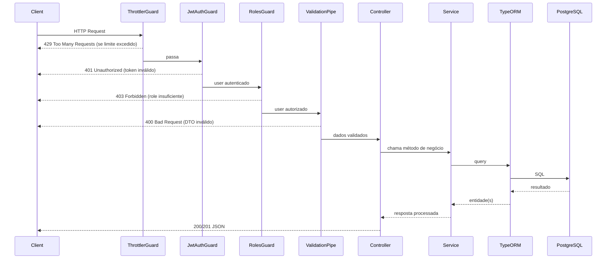

# 02 — Componentes e Módulos NestJS

## Diagrama de Componentes (C4 Nível 3)

```mermaid
graph TB
  subgraph Client["Clientes"]
    APP[App Mobile\nPassageiro / Capitão]
    WEB[Painel Web\nAdministrador]
  end

  subgraph API["NestJS API — src/"]
    direction TB

    subgraph Auth["🔐 Auth"]
      AuthCtrl[AuthController\n/auth]
      AuthSvc[AuthService]
      JwtStrat[JwtStrategy]
      ThrottleGuard[ThrottlerGuard\nRate Limiting]
    end

    subgraph Users["👤 Users"]
      UsersCtrl[UsersController\n/users]
      UsersSvc[UsersService]
    end

    subgraph Boats["⛵ Boats"]
      BoatsCtrl[BoatsController\n/boats]
      BoatsSvc[BoatsService]
    end

    subgraph Trips["🗺️ Trips"]
      TripsCtrl[TripsController\n/trips]
      TripsSvc[TripsService]
    end

    subgraph Bookings["🎫 Bookings"]
      BookCtrl[BookingsController\n/bookings]
      BookSvc[BookingsService]
    end

    subgraph Shipments["📦 Shipments"]
      ShipCtrl[ShipmentsController\n/shipments]
      ShipSvc[ShipmentsService]
      StorageSvc[StorageService]
    end

    subgraph Cargo["🚗 Cargo"]
      CargoCtrl[CargoController\n/cargo]
      CargoSvc[CargoService]
    end

    subgraph Reviews["⭐ Reviews"]
      RevCtrl[ReviewsController\n/reviews]
      RevSvc[ReviewsService]
    end

    subgraph Coupons["🎟️ Coupons"]
      CouCtrl[CouponsController\n/coupons]
      PromoCtrl[PromotionsController\n/promotions]
      CouSvc[CouponsService]
      PromoSvc[PromotionsService]
    end

    subgraph Gamification["🏆 Gamification"]
      GamCtrl[GamificationController\n/gamification]
      GamSvc[GamificationService]
    end

    subgraph Safety["🛡️ Safety"]
      SafeCtrl[SafetyController\n/safety]
      SafeSvc[SafetyService]
    end

    subgraph Weather["🌤️ Weather"]
      WeathCtrl[WeatherController\n/weather]
      WeathSvc[WeatherService]
    end

    subgraph Notifications["🔔 Notifications"]
      NotifCtrl[NotificationsController\n/notifications]
      NotifSvc[NotificationsService\nFCM]
    end

    subgraph Upload["📸 Upload"]
      UpCtrl[UploadController\n/upload]
    end

    subgraph Admin["🔧 Admin"]
      AdminCtrl[AdminController\n/admin]
      AdminSvc[AdminService]
    end

    subgraph Favorites["❤️ Favorites"]
      FavCtrl[FavoritesController\n/favorites]
      FavSvc[FavoritesService]
    end
  end

  subgraph DB["PostgreSQL"]
    PG[(Database)]
  end

  APP --> Auth
  APP --> Trips
  APP --> Bookings
  APP --> Shipments
  APP --> Reviews
  APP --> Safety
  WEB --> Admin
  WEB --> Auth

  TripsSvc --> NotifSvc
  BookSvc --> NotifSvc
  ShipSvc --> NotifSvc
  TripsSvc --> SafeSvc
  TripsSvc --> WeathSvc
  BookSvc --> CouSvc
  ShipSvc --> CouSvc
  GamSvc --> BookSvc
  AdminSvc --> RevSvc

  Auth --> PG
  Users --> PG
  Boats --> PG
  Trips --> PG
  Bookings --> PG
  Shipments --> PG
  Reviews --> PG
  Admin --> PG
  Gamification --> PG
  Safety --> PG
  Favorites --> PG
```



---

## Dependências entre Módulos

| Módulo | Importa / Depende de |
|---|---|
| **Auth** | UsersModule, JwtModule, PassportModule, MailModule |
| **Trips** | ShipmentsModule (forwardRef), SafetyModule, WeatherModule, NotificationsModule, BookingsModule |
| **Bookings** | CouponsModule, NotificationsModule, GamificationModule |
| **Shipments** | CouponsModule, NotificationsModule, StorageService |
| **Reviews** | BoatsModule (rating update), UsersModule (rating update) |
| **Safety** | WeatherModule (clima para checklist) |
| **Admin** | UsersModule, TripsModule, ShipmentsModule, ReviewsModule, BoatsModule, BookingsModule, NotificationsModule |
| **Promotions** | CouponsModule, TripsModule |

---

## Guards e Decoradores

```
@UseGuards(JwtAuthGuard)          → Valida JWT em todos os endpoints protegidos
@UseGuards(RolesGuard)            → Verifica role do utilizador
@Roles(UserRole.CAPTAIN)          → Restringe a capitães
@Roles(UserRole.ADMIN)            → Restringe a admins
@Public()                         → Endpoint público (sem JWT)
@SkipThrottle()                   → Sem rate limiting (ex: GET /auth/me)
@Throttle({ strict: {...} })      → Rate limit personalizado
```

---

## Fluxo de um Pedido HTTP


