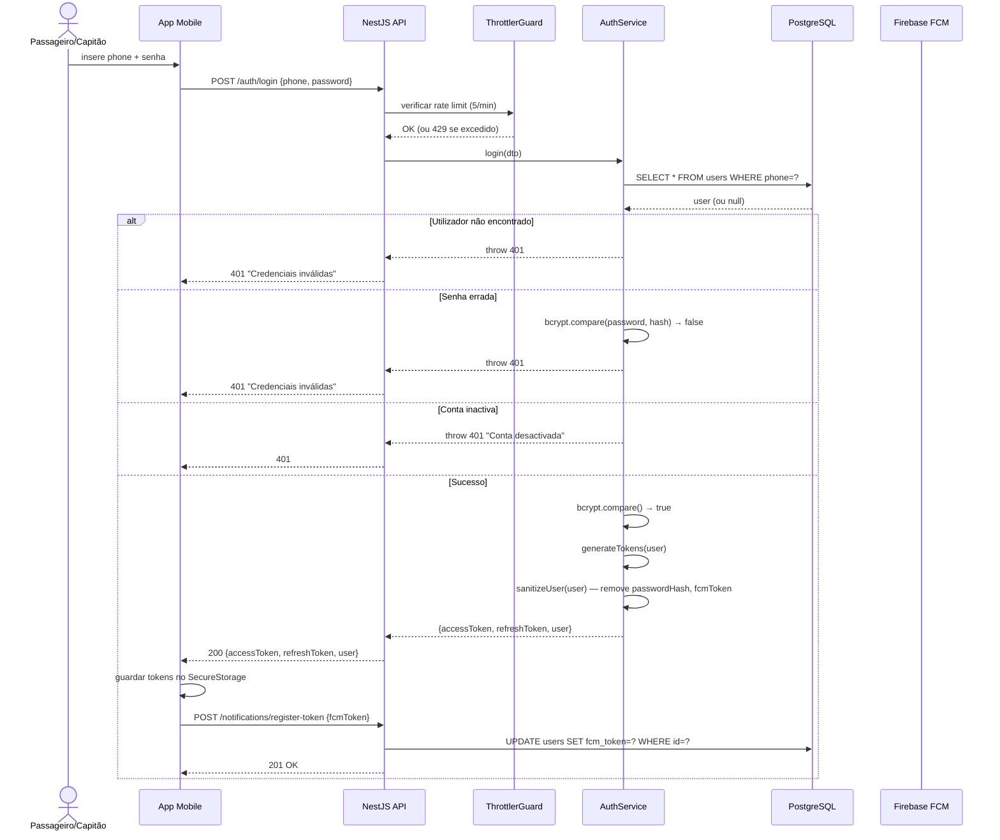
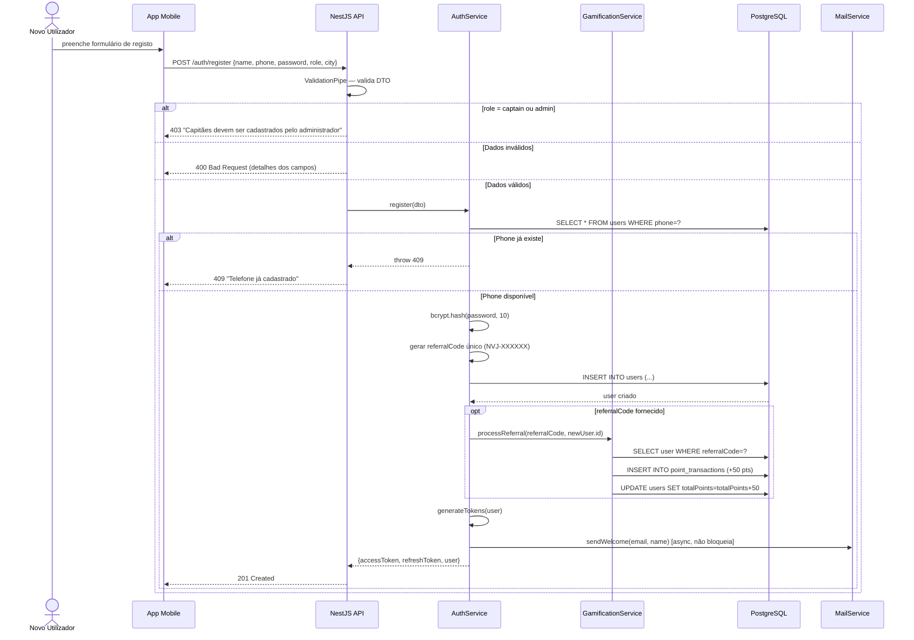
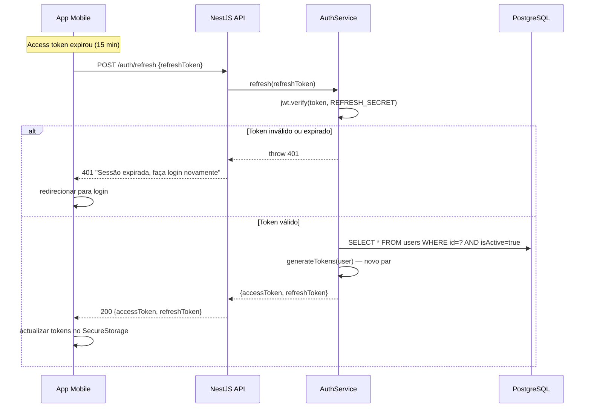
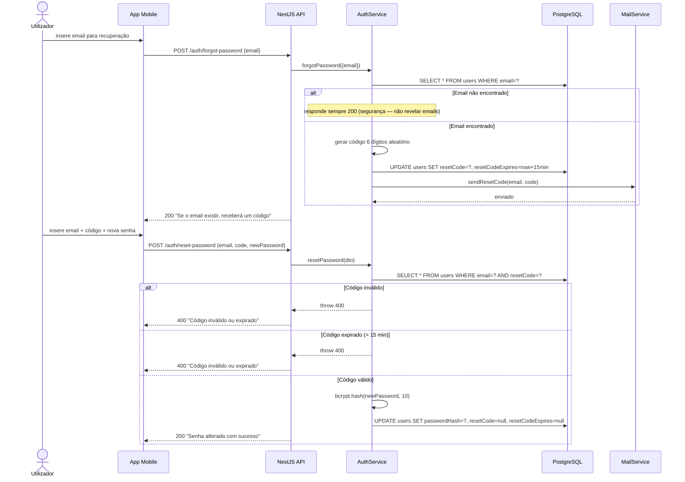

# SEQ01 — Diagramas de Sequência: Login e Registo

## Login com Telefone (App Mobile)

```mermaid
sequenceDiagram
  actor User as Passageiro/Capitão
  participant App as App Mobile
  participant API as NestJS API
  participant Throttle as ThrottlerGuard
  participant AuthSvc as AuthService
  participant DB as PostgreSQL
  participant FCM as Firebase FCM

  User->>App: insere phone + senha
  App->>API: POST /auth/login {phone, password}
  API->>Throttle: verificar rate limit (5/min)
  Throttle-->>API: OK (ou 429 se excedido)
  API->>AuthSvc: login(dto)
  AuthSvc->>DB: SELECT * FROM users WHERE phone=?
  DB-->>AuthSvc: user (ou null)

  alt Utilizador não encontrado
    AuthSvc-->>API: throw 401
    API-->>App: 401 "Credenciais inválidas"
  else Senha errada
    AuthSvc->>AuthSvc: bcrypt.compare(password, hash) → false
    AuthSvc-->>API: throw 401
    API-->>App: 401 "Credenciais inválidas"
  else Conta inactiva
    AuthSvc-->>API: throw 401 "Conta desactivada"
    API-->>App: 401
  else Sucesso
    AuthSvc->>AuthSvc: bcrypt.compare() → true
    AuthSvc->>AuthSvc: generateTokens(user)
    AuthSvc->>AuthSvc: sanitizeUser(user) — remove passwordHash, fcmToken
    AuthSvc-->>API: {accessToken, refreshToken, user}
    API-->>App: 200 {accessToken, refreshToken, user}
    App->>App: guardar tokens no SecureStorage
    App->>API: POST /notifications/register-token {fcmToken}
    API->>DB: UPDATE users SET fcm_token=? WHERE id=?
    API-->>App: 201 OK
  end
```

---

## Registo de Novo Passageiro

```mermaid
sequenceDiagram
  actor User as Novo Utilizador
  participant App as App Mobile
  participant API as NestJS API
  participant AuthSvc as AuthService
  participant GamSvc as GamificationService
  participant DB as PostgreSQL
  participant Mail as MailService

  User->>App: preenche formulário de registo
  App->>API: POST /auth/register {name, phone, password, role, city}
  API->>API: ValidationPipe — valida DTO

  alt role = captain ou admin
    API-->>App: 403 "Capitães devem ser cadastrados pelo administrador"
  else Dados inválidos
    API-->>App: 400 Bad Request (detalhes dos campos)
  else Dados válidos
    API->>AuthSvc: register(dto)
    AuthSvc->>DB: SELECT * FROM users WHERE phone=?

    alt Phone já existe
      AuthSvc-->>API: throw 409
      API-->>App: 409 "Telefone já cadastrado"
    else Phone disponível
      AuthSvc->>AuthSvc: bcrypt.hash(password, 10)
      AuthSvc->>AuthSvc: gerar referralCode único (NVJ-XXXXXX)
      AuthSvc->>DB: INSERT INTO users (...)
      DB-->>AuthSvc: user criado

      opt referralCode fornecido
        AuthSvc->>GamSvc: processReferral(referralCode, newUser.id)
        GamSvc->>DB: SELECT user WHERE referralCode=?
        GamSvc->>DB: INSERT INTO point_transactions (+50 pts)
        GamSvc->>DB: UPDATE users SET totalPoints=totalPoints+50
      end

      AuthSvc->>AuthSvc: generateTokens(user)
      AuthSvc->>Mail: sendWelcome(email, name) [async, não bloqueia]
      AuthSvc-->>API: {accessToken, refreshToken, user}
      API-->>App: 201 Created
    end
  end
```

---

## Renovação de Token (Refresh)

```mermaid
sequenceDiagram
  participant App as App Mobile
  participant API as NestJS API
  participant AuthSvc as AuthService
  participant DB as PostgreSQL

  Note over App: Access token expirou (15 min)
  App->>API: POST /auth/refresh {refreshToken}
  API->>AuthSvc: refresh(refreshToken)
  AuthSvc->>AuthSvc: jwt.verify(token, REFRESH_SECRET)

  alt Token inválido ou expirado
    AuthSvc-->>API: throw 401
    API-->>App: 401 "Sessão expirada, faça login novamente"
    App->>App: redirecionar para login
  else Token válido
    AuthSvc->>DB: SELECT * FROM users WHERE id=? AND isActive=true
    AuthSvc->>AuthSvc: generateTokens(user) — novo par
    AuthSvc-->>API: {accessToken, refreshToken}
    API-->>App: 200 {accessToken, refreshToken}
    App->>App: actualizar tokens no SecureStorage
  end
```

---

## Recuperação de Senha

```mermaid
sequenceDiagram
  actor User as Utilizador
  participant App as App Mobile
  participant API as NestJS API
  participant AuthSvc as AuthService
  participant DB as PostgreSQL
  participant Mail as MailService

  User->>App: insere email para recuperação
  App->>API: POST /auth/forgot-password {email}
  API->>AuthSvc: forgotPassword({email})
  AuthSvc->>DB: SELECT * FROM users WHERE email=?

  alt Email não encontrado
    Note over AuthSvc: responde sempre 200 (segurança — não revelar emails)
  else Email encontrado
    AuthSvc->>AuthSvc: gerar código 6 dígitos aleatório
    AuthSvc->>DB: UPDATE users SET resetCode=?, resetCodeExpires=now+15min
    AuthSvc->>Mail: sendResetCode(email, code)
    Mail-->>AuthSvc: enviado
  end

  API-->>App: 200 "Se o email existir, receberá um código"

  User->>App: insere email + código + nova senha
  App->>API: POST /auth/reset-password {email, code, newPassword}
  API->>AuthSvc: resetPassword(dto)
  AuthSvc->>DB: SELECT * FROM users WHERE email=? AND resetCode=?

  alt Código inválido
    AuthSvc-->>API: throw 400
    API-->>App: 400 "Código inválido ou expirado"
  else Código expirado (> 15 min)
    AuthSvc-->>API: throw 400
    API-->>App: 400 "Código inválido ou expirado"
  else Código válido
    AuthSvc->>AuthSvc: bcrypt.hash(newPassword, 10)
    AuthSvc->>DB: UPDATE users SET passwordHash=?, resetCode=null, resetCodeExpires=null
    API-->>App: 200 "Senha alterada com sucesso"
  end
```
