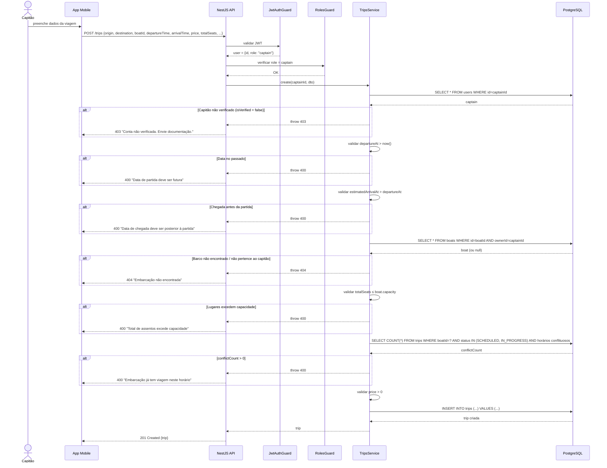
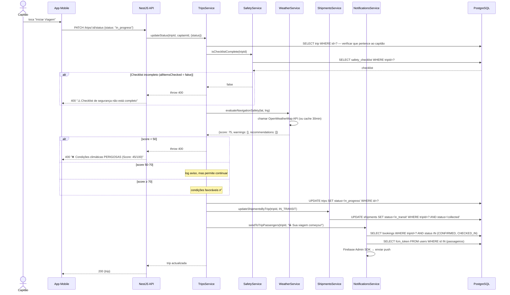
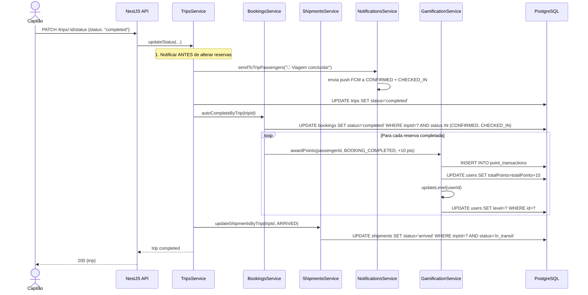

# SEQ02 — Diagrama de Sequência: Criar e Gerir Viagem

## Criar Viagem (Capitão)

```mermaid
sequenceDiagram
  actor Captain as Capitão
  participant App as App Mobile
  participant API as NestJS API
  participant JwtGuard as JwtAuthGuard
  participant RolesGuard as RolesGuard
  participant TripsSvc as TripsService
  participant DB as PostgreSQL

  Captain->>App: preenche dados da viagem
  App->>API: POST /trips {origin, destination, boatId, departureTime, arrivalTime, price, totalSeats, ...}
  API->>JwtGuard: validar JWT
  JwtGuard-->>API: user = {id, role: "captain"}
  API->>RolesGuard: verificar role = captain
  RolesGuard-->>API: OK

  API->>TripsSvc: create(captainId, dto)

  TripsSvc->>DB: SELECT * FROM users WHERE id=captainId
  DB-->>TripsSvc: captain

  alt Capitão não verificado (isVerified = false)
    TripsSvc-->>API: throw 403
    API-->>App: 403 "Conta não verificada. Envie documentação."
  end

  TripsSvc->>TripsSvc: validar departureAt > now()
  alt Data no passado
    TripsSvc-->>API: throw 400
    API-->>App: 400 "Data de partida deve ser futura"
  end

  TripsSvc->>TripsSvc: validar estimatedArrivalAt > departureAt
  alt Chegada antes da partida
    TripsSvc-->>API: throw 400
    API-->>App: 400 "Data de chegada deve ser posterior à partida"
  end

  TripsSvc->>DB: SELECT * FROM boats WHERE id=boatId AND ownerId=captainId
  DB-->>TripsSvc: boat (ou null)
  alt Barco não encontrado / não pertence ao capitão
    TripsSvc-->>API: throw 404
    API-->>App: 404 "Embarcação não encontrada"
  end

  TripsSvc->>TripsSvc: validar totalSeats ≤ boat.capacity
  alt Lugares excedem capacidade
    TripsSvc-->>API: throw 400
    API-->>App: 400 "Total de assentos excede capacidade"
  end

  TripsSvc->>DB: SELECT COUNT(*) FROM trips WHERE boatId=? AND status IN (SCHEDULED, IN_PROGRESS) AND horários conflituosos
  DB-->>TripsSvc: conflictCount

  alt conflictCount > 0
    TripsSvc-->>API: throw 400
    API-->>App: 400 "Embarcação já tem viagem neste horário"
  end

  TripsSvc->>TripsSvc: validar price > 0

  TripsSvc->>DB: INSERT INTO trips (...) VALUES (...)
  DB-->>TripsSvc: trip criada

  TripsSvc-->>API: trip
  API-->>App: 201 Created {trip}
```

---

## Iniciar Viagem (SCHEDULED → IN_PROGRESS)

```mermaid
sequenceDiagram
  actor Captain as Capitão
  participant App as App Mobile
  participant API as NestJS API
  participant TripsSvc as TripsService
  participant SafetySvc as SafetyService
  participant WeatherSvc as WeatherService
  participant ShipmentsSvc as ShipmentsService
  participant NotifSvc as NotificationsService
  participant DB as PostgreSQL

  Captain->>App: toca "Iniciar Viagem"
  App->>API: PATCH /trips/:id/status {status: "in_progress"}
  API->>TripsSvc: updateStatus(tripId, captainId, {status})
  TripsSvc->>DB: SELECT trip WHERE id=? — verificar que pertence ao capitão

  TripsSvc->>SafetySvc: isChecklistComplete(tripId)
  SafetySvc->>DB: SELECT safety_checklist WHERE tripId=?
  DB-->>SafetySvc: checklist

  alt Checklist incompleto (allItemsChecked = false)
    SafetySvc-->>TripsSvc: false
    TripsSvc-->>API: throw 400
    API-->>App: 400 "⚠️ Checklist de segurança não está completo"
  end

  TripsSvc->>WeatherSvc: evaluateNavigationSafety(lat, lng)
  WeatherSvc->>WeatherSvc: chamar OpenWeatherMap API (ou cache 30min)
  WeatherSvc-->>TripsSvc: {score: 75, warnings: [], recommendations: []}

  alt score < 50
    TripsSvc-->>API: throw 400
    API-->>App: 400 "❌ Condições climáticas PERIGOSAS (Score: 45/100)"
  else score 50-70
    Note over TripsSvc: log aviso, mas permite continuar
  else score ≥ 70
    Note over TripsSvc: condições favoráveis ✅
  end

  TripsSvc->>DB: UPDATE trips SET status='in_progress' WHERE id=?
  TripsSvc->>ShipmentsSvc: updateShipmentsByTrip(tripId, IN_TRANSIT)
  ShipmentsSvc->>DB: UPDATE shipments SET status='in_transit' WHERE tripId=? AND status='collected'

  TripsSvc->>NotifSvc: sendToTripPassengers(tripId, "⛵ Sua viagem começou!")
  NotifSvc->>DB: SELECT bookings WHERE tripId=? AND status IN (CONFIRMED, CHECKED_IN)
  NotifSvc->>DB: SELECT fcm_token FROM users WHERE id IN (passageiros)
  NotifSvc->>NotifSvc: Firebase Admin SDK → enviar push

  TripsSvc-->>API: trip actualizada
  API-->>App: 200 {trip}
```

---

## Concluir Viagem (IN_PROGRESS → COMPLETED)

```mermaid
sequenceDiagram
  actor Captain as Capitão
  participant API as NestJS API
  participant TripsSvc as TripsService
  participant BookSvc as BookingsService
  participant ShipSvc as ShipmentsService
  participant NotifSvc as NotificationsService
  participant GamSvc as GamificationService
  participant DB as PostgreSQL

  Captain->>API: PATCH /trips/:id/status {status: "completed"}
  API->>TripsSvc: updateStatus(...)

  Note over TripsSvc: 1. Notificar ANTES de alterar reservas
  TripsSvc->>NotifSvc: sendToTripPassengers("🏁 Viagem concluída!")
  NotifSvc->>NotifSvc: envia push FCM a CONFIRMED + CHECKED_IN

  TripsSvc->>DB: UPDATE trips SET status='completed'

  TripsSvc->>BookSvc: autoCompleteByTrip(tripId)
  BookSvc->>DB: UPDATE bookings SET status='completed' WHERE tripId=? AND status IN (CONFIRMED, CHECKED_IN)
  loop Para cada reserva completada
    BookSvc->>GamSvc: awardPoints(passengerId, BOOKING_COMPLETED, +10 pts)
    GamSvc->>DB: INSERT INTO point_transactions
    GamSvc->>DB: UPDATE users SET totalPoints=totalPoints+10
    GamSvc->>GamSvc: updateLevel(userId)
    GamSvc->>DB: UPDATE users SET level=? WHERE id=?
  end

  TripsSvc->>ShipSvc: updateShipmentsByTrip(tripId, ARRIVED)
  ShipSvc->>DB: UPDATE shipments SET status='arrived' WHERE tripId=? AND status='in_transit'

  TripsSvc-->>API: trip completed
  API-->>Captain: 200 {trip}
```
