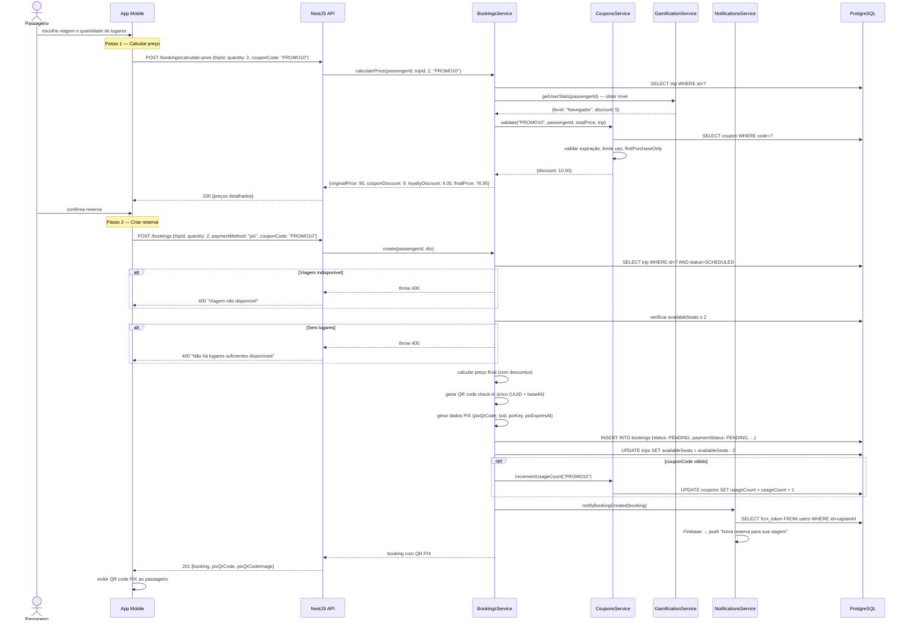
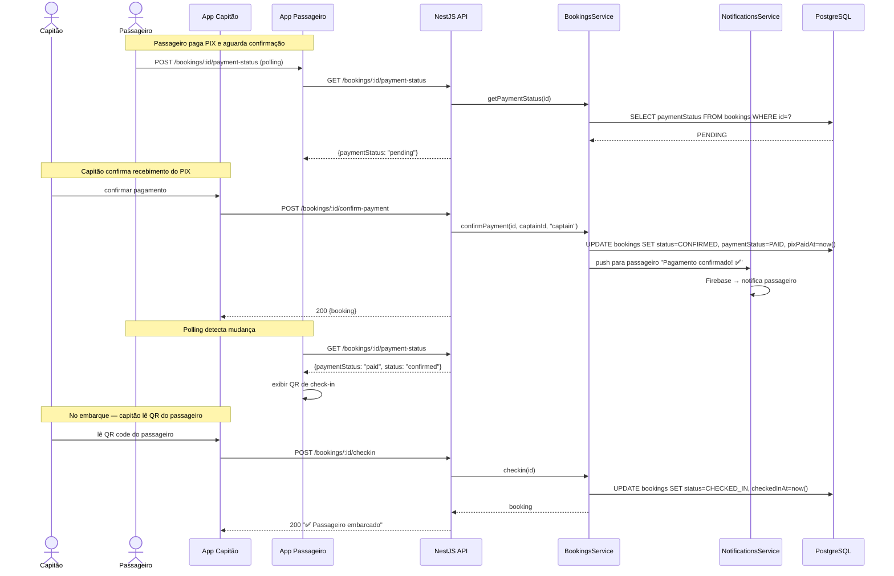
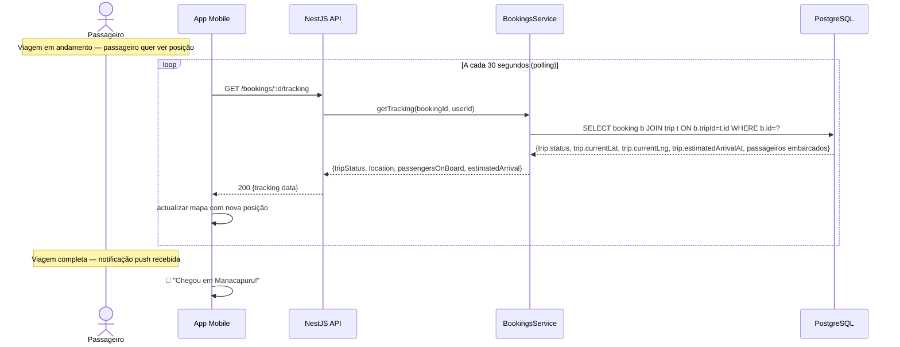

# SEQ03 — Diagrama de Sequência: Fluxo Completo de Reserva

## Criar Reserva com PIX

```mermaid
sequenceDiagram
  actor Passenger as Passageiro
  participant App as App Mobile
  participant API as NestJS API
  participant BookSvc as BookingsService
  participant CouSvc as CouponsService
  participant GamSvc as GamificationService
  participant NotifSvc as NotificationsService
  participant DB as PostgreSQL

  Passenger->>App: escolhe viagem e quantidade de lugares

  Note over App: Passo 1 — Calcular preço
  App->>API: POST /bookings/calculate-price {tripId, quantity: 2, couponCode: "PROMO10"}
  API->>BookSvc: calculatePrice(passengerId, tripId, 2, "PROMO10")
  BookSvc->>DB: SELECT trip WHERE id=?
  BookSvc->>GamSvc: getUserStats(passengerId) — obter nível
  GamSvc-->>BookSvc: {level: "Navegador", discount: 5}
  BookSvc->>CouSvc: validate("PROMO10", passengerId, totalPrice, trip)
  CouSvc->>DB: SELECT coupon WHERE code=?
  CouSvc->>CouSvc: validar expiração, limite uso, firstPurchaseOnly
  CouSvc-->>BookSvc: {discount: 10.00}
  BookSvc-->>API: {originalPrice: 90, couponDiscount: 9, loyaltyDiscount: 4.05, finalPrice: 76.95}
  API-->>App: 200 {preços detalhados}

  Passenger->>App: confirma reserva
  Note over App: Passo 2 — Criar reserva
  App->>API: POST /bookings {tripId, quantity: 2, paymentMethod: "pix", couponCode: "PROMO10"}
  API->>BookSvc: create(passengerId, dto)

  BookSvc->>DB: SELECT trip WHERE id=? AND status=SCHEDULED
  alt Viagem indisponível
    BookSvc-->>API: throw 400
    API-->>App: 400 "Viagem não disponível"
  end

  BookSvc->>DB: verificar availableSeats ≥ 2
  alt Sem lugares
    BookSvc-->>API: throw 400
    API-->>App: 400 "Não há lugares suficientes disponíveis"
  end

  BookSvc->>BookSvc: calcular preço final (com descontos)
  BookSvc->>BookSvc: gerar QR code check-in único (UUID + base64)
  BookSvc->>BookSvc: gerar dados PIX (pixQrCode, txid, pixKey, pixExpiresAt)

  BookSvc->>DB: INSERT INTO bookings {status: PENDING, paymentStatus: PENDING, ...}
  BookSvc->>DB: UPDATE trips SET availableSeats = availableSeats - 2

  opt couponCode válido
    BookSvc->>CouSvc: incrementUsageCount("PROMO10")
    CouSvc->>DB: UPDATE coupons SET usageCount = usageCount + 1
  end

  BookSvc->>NotifSvc: notifyBookingCreated(booking)
  NotifSvc->>DB: SELECT fcm_token FROM users WHERE id=captainId
  NotifSvc->>NotifSvc: Firebase → push "Nova reserva para sua viagem"

  BookSvc-->>API: booking com QR PIX
  API-->>App: 201 {booking, pixQrCode, pixQrCodeImage}
  App->>App: exibir QR code PIX ao passageiro
```

---

## Confirmar Pagamento e Check-in

```mermaid
sequenceDiagram
  actor Captain as Capitão
  actor Passenger as Passageiro
  participant CaptApp as App Capitão
  participant PassApp as App Passageiro
  participant API as NestJS API
  participant BookSvc as BookingsService
  participant NotifSvc as NotificationsService
  participant DB as PostgreSQL

  Note over Passenger, PassApp: Passageiro paga PIX e aguarda confirmação

  Passenger->>PassApp: POST /bookings/:id/payment-status (polling)
  PassApp->>API: GET /bookings/:id/payment-status
  API->>BookSvc: getPaymentStatus(id)
  BookSvc->>DB: SELECT paymentStatus FROM bookings WHERE id=?
  DB-->>BookSvc: PENDING
  API-->>PassApp: {paymentStatus: "pending"}

  Note over Captain, CaptApp: Capitão confirma recebimento do PIX
  Captain->>CaptApp: confirmar pagamento
  CaptApp->>API: POST /bookings/:id/confirm-payment
  API->>BookSvc: confirmPayment(id, captainId, "captain")
  BookSvc->>DB: UPDATE bookings SET status=CONFIRMED, paymentStatus=PAID, pixPaidAt=now()
  BookSvc->>NotifSvc: push para passageiro "Pagamento confirmado! ✅"
  NotifSvc->>NotifSvc: Firebase → notifica passageiro
  API-->>CaptApp: 200 {booking}

  Note over Passenger, PassApp: Polling detecta mudança
  PassApp->>API: GET /bookings/:id/payment-status
  API-->>PassApp: {paymentStatus: "paid", status: "confirmed"}
  PassApp->>PassApp: exibir QR de check-in

  Note over Captain, CaptApp: No embarque — capitão lê QR do passageiro
  Captain->>CaptApp: lê QR code do passageiro
  CaptApp->>API: POST /bookings/:id/checkin
  API->>BookSvc: checkin(id)
  BookSvc->>DB: UPDATE bookings SET status=CHECKED_IN, checkedInAt=now()
  BookSvc-->>API: booking
  API-->>CaptApp: 200 "✅ Passageiro embarcado"
```

---

## Tracking em Tempo Real

```mermaid
sequenceDiagram
  actor Passenger as Passageiro
  participant App as App Mobile
  participant API as NestJS API
  participant BookSvc as BookingsService
  participant DB as PostgreSQL

  Note over Passenger: Viagem em andamento — passageiro quer ver posição

  loop A cada 30 segundos (polling)
    App->>API: GET /bookings/:id/tracking
    API->>BookSvc: getTracking(bookingId, userId)
    BookSvc->>DB: SELECT booking b JOIN trip t ON b.tripId=t.id WHERE b.id=?
    DB-->>BookSvc: {trip.status, trip.currentLat, trip.currentLng, trip.estimatedArrivalAt, passageiros embarcados}
    BookSvc-->>API: {tripStatus, location, passengersOnBoard, estimatedArrival}
    API-->>App: 200 {tracking data}
    App->>App: actualizar mapa com nova posição
  end

  Note over Passenger: Viagem completa — notificação push recebida
  App->>App: 🏁 "Chegou em Manacapuru!"
```
