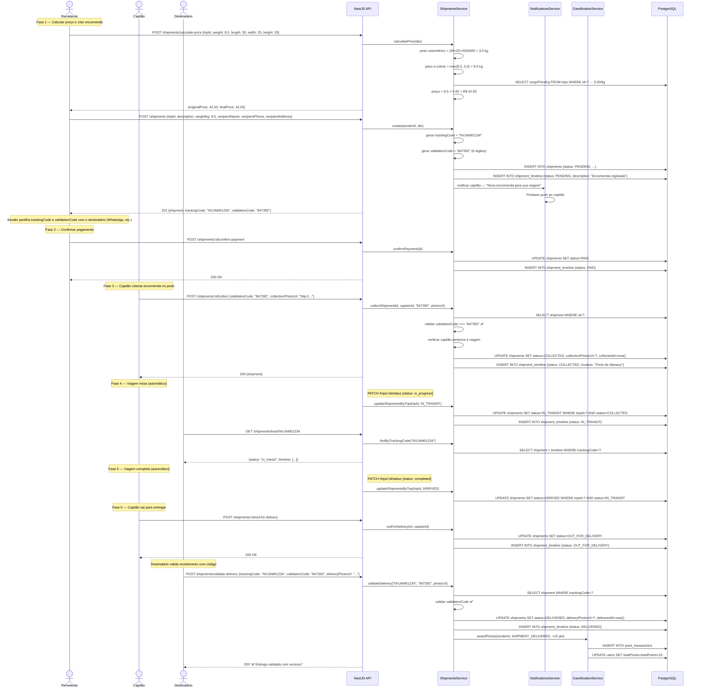

# SEQ04 — Diagrama de Sequência: Fluxo de Encomenda

## Enviar Encomenda (Fim a Fim)

```mermaid
sequenceDiagram
  actor Sender as Remetente
  actor Captain as Capitão
  actor Recipient as Destinatário
  participant API as NestJS API
  participant ShipSvc as ShipmentsService
  participant NotifSvc as NotificationsService
  participant GamSvc as GamificationService
  participant DB as PostgreSQL

  %% FASE 1: CRIAÇÃO
  Note over Sender: Fase 1 — Calcular preço e criar encomenda

  Sender->>API: POST /shipments/calculate-price {tripId, weight: 8.5, length: 30, width: 25, height: 20}
  API->>ShipSvc: calculatePrice(dto)
  ShipSvc->>ShipSvc: peso volumétrico = (30×25×20)/5000 = 3.0 kg
  ShipSvc->>ShipSvc: peso a cobrar = max(8.5, 3.0) = 8.5 kg
  ShipSvc->>DB: SELECT cargoPriceKg FROM trips WHERE id=? → 5.00/kg
  ShipSvc->>ShipSvc: preço = 8.5 × 5.00 = R$ 42.50
  API-->>Sender: {originalPrice: 42.50, finalPrice: 42.50}

  Sender->>API: POST /shipments {tripId, description, weightKg: 8.5, recipientName, recipientPhone, recipientAddress}
  API->>ShipSvc: create(senderId, dto)
  ShipSvc->>ShipSvc: gerar trackingCode = "NVJAM01234"
  ShipSvc->>ShipSvc: gerar validationCode = "847392" (6 dígitos)
  ShipSvc->>DB: INSERT INTO shipments {status: PENDING, ...}
  ShipSvc->>DB: INSERT INTO shipment_timeline {status: PENDING, description: "Encomenda registada"}
  ShipSvc->>NotifSvc: notificar capitão — "Nova encomenda para sua viagem"
  NotifSvc->>NotifSvc: Firebase push ao capitão
  API-->>Sender: 201 {shipment, trackingCode: "NVJAM01234", validationCode: "847392"}

  Note over Sender: Sender partilha trackingCode e validationCode com o destinatário (WhatsApp, etc.)

  %% FASE 2: PAGAMENTO
  Note over Sender: Fase 2 — Confirmar pagamento

  Sender->>API: POST /shipments/:id/confirm-payment
  API->>ShipSvc: confirmPayment(id)
  ShipSvc->>DB: UPDATE shipments SET status=PAID
  ShipSvc->>DB: INSERT INTO shipment_timeline {status: PAID}
  API-->>Sender: 200 OK

  %% FASE 3: COLECTA
  Note over Captain: Fase 3 — Capitão colecta encomenda no porto

  Captain->>API: POST /shipments/:id/collect {validationCode: "847392", collectionPhotoUrl: "http://..."}
  API->>ShipSvc: collectShipment(id, captainId, "847392", photoUrl)
  ShipSvc->>DB: SELECT shipment WHERE id=?
  ShipSvc->>ShipSvc: validar validationCode === "847392" ✅
  ShipSvc->>ShipSvc: verificar capitão pertence à viagem
  ShipSvc->>DB: UPDATE shipments SET status=COLLECTED, collectionPhotoUrl=?, collectedAt=now()
  ShipSvc->>DB: INSERT INTO shipment_timeline {status: COLLECTED, location: "Porto de Manaus"}
  API-->>Captain: 200 {shipment}

  %% FASE 4: TRÂNSITO (automático ao iniciar viagem)
  Note over Captain: Fase 4 — Viagem inicia (automático)
  Note right of API: PATCH /trips/:id/status {status: in_progress}
  API->>ShipSvc: updateShipmentsByTrip(tripId, IN_TRANSIT)
  ShipSvc->>DB: UPDATE shipments SET status=IN_TRANSIT WHERE tripId=? AND status=COLLECTED
  ShipSvc->>DB: INSERT INTO shipment_timeline {status: IN_TRANSIT}

  %% RASTREAMENTO PÚBLICO
  Recipient->>API: GET /shipments/track/NVJAM01234
  API->>ShipSvc: findByTrackingCode("NVJAM01234")
  ShipSvc->>DB: SELECT shipment + timeline WHERE trackingCode=?
  API-->>Recipient: {status: "in_transit", timeline: [...]}

  %% FASE 5: CHEGADA (automático ao completar viagem)
  Note over Captain: Fase 5 — Viagem completa (automático)
  Note right of API: PATCH /trips/:id/status {status: completed}
  API->>ShipSvc: updateShipmentsByTrip(tripId, ARRIVED)
  ShipSvc->>DB: UPDATE shipments SET status=ARRIVED WHERE tripId=? AND status=IN_TRANSIT

  %% FASE 6: ENTREGA
  Note over Captain: Fase 6 — Capitão sai para entregar

  Captain->>API: POST /shipments/:id/out-for-delivery
  API->>ShipSvc: outForDelivery(id, captainId)
  ShipSvc->>DB: UPDATE shipments SET status=OUT_FOR_DELIVERY
  ShipSvc->>DB: INSERT INTO shipment_timeline {status: OUT_FOR_DELIVERY}
  API-->>Captain: 200 OK

  %% VALIDAÇÃO FINAL
  Note over Recipient: Destinatário valida recebimento com código
  Recipient->>API: POST /shipments/validate-delivery {trackingCode: "NVJAM01234", validationCode: "847392", deliveryPhotoUrl: "..."}
  API->>ShipSvc: validateDelivery("NVJAM01234", "847392", photoUrl)
  ShipSvc->>DB: SELECT shipment WHERE trackingCode=?
  ShipSvc->>ShipSvc: validar validationCode ✅
  ShipSvc->>DB: UPDATE shipments SET status=DELIVERED, deliveryPhotoUrl=?, deliveredAt=now()
  ShipSvc->>DB: INSERT INTO shipment_timeline {status: DELIVERED}
  ShipSvc->>GamSvc: awardPoints(senderId, SHIPMENT_DELIVERED, +15 pts)
  GamSvc->>DB: INSERT INTO point_transactions
  GamSvc->>DB: UPDATE users SET totalPoints=totalPoints+15
  API-->>Recipient: 200 "✅ Entrega validada com sucesso"
```
