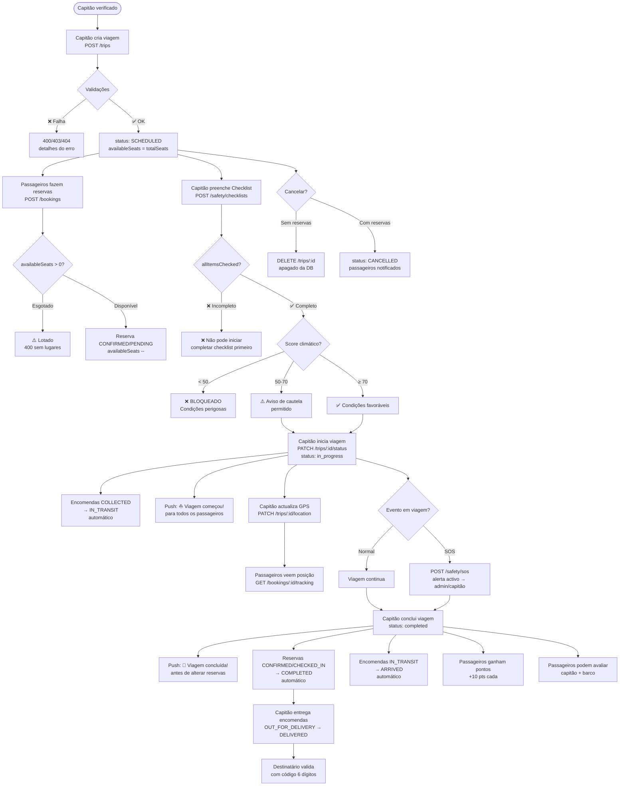
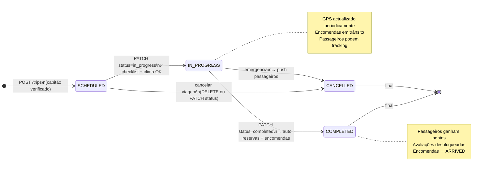
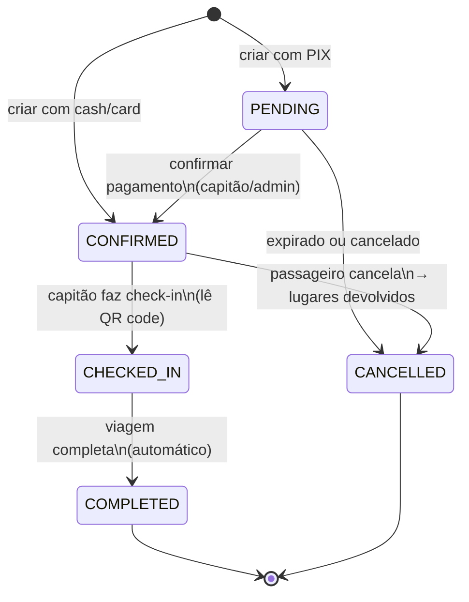
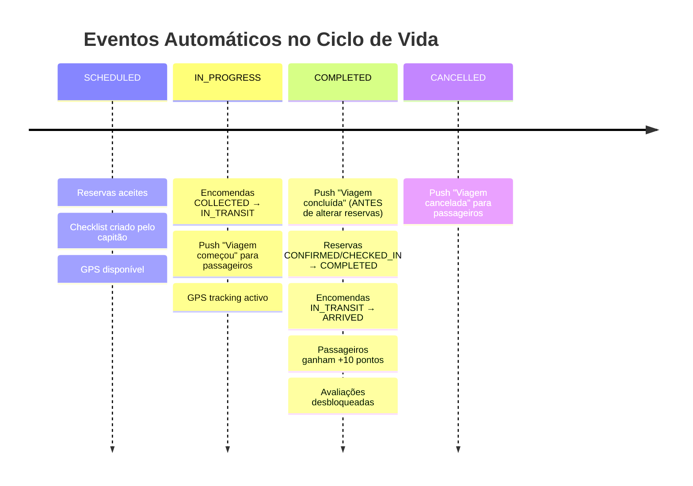

# SEQ05 — Ciclo de Vida Completo da Viagem

## Diagrama de Actividade — Ciclo de Vida de uma Viagem

---

## Diagrama de Estados — Trip

---

## Diagrama de Estados — Booking

---

## Timeline de Efeitos Automáticos

