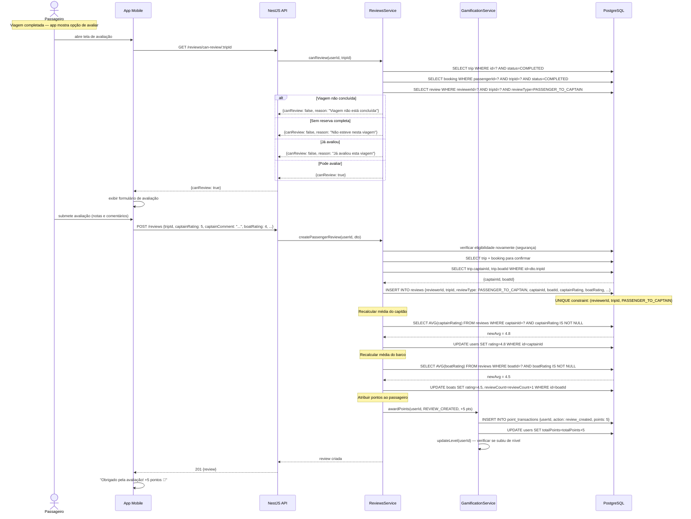
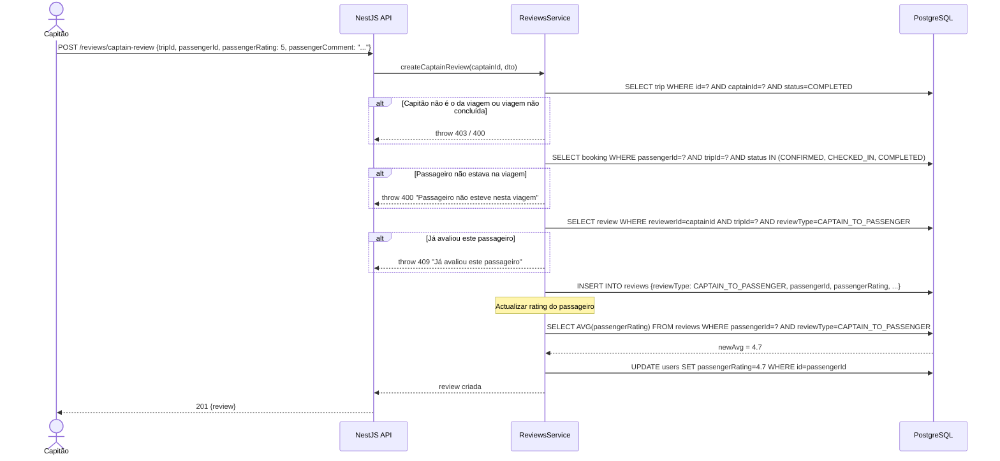
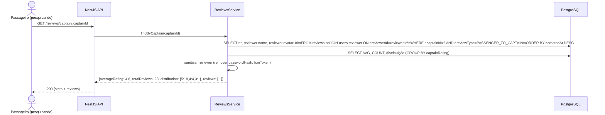

# SEQ06 — Diagrama de Sequência: Avaliação Pós-Viagem

## Passageiro Avalia Capitão e Barco

```mermaid
sequenceDiagram
  actor Passenger as Passageiro
  participant App as App Mobile
  participant API as NestJS API
  participant RevSvc as ReviewsService
  participant GamSvc as GamificationService
  participant DB as PostgreSQL

  Note over Passenger: Viagem completada — app mostra opção de avaliar

  Passenger->>App: abre tela de avaliação
  App->>API: GET /reviews/can-review/:tripId
  API->>RevSvc: canReview(userId, tripId)
  RevSvc->>DB: SELECT trip WHERE id=? AND status=COMPLETED
  RevSvc->>DB: SELECT booking WHERE passengerId=? AND tripId=? AND status=COMPLETED
  RevSvc->>DB: SELECT review WHERE reviewerId=? AND tripId=? AND reviewType=PASSENGER_TO_CAPTAIN

  alt Viagem não concluída
    RevSvc-->>API: {canReview: false, reason: "Viagem não está concluída"}
  else Sem reserva completa
    RevSvc-->>API: {canReview: false, reason: "Não esteve nesta viagem"}
  else Já avaliou
    RevSvc-->>API: {canReview: false, reason: "Já avaliou esta viagem"}
  else Pode avaliar
    RevSvc-->>API: {canReview: true}
  end

  API-->>App: {canReview: true}
  App->>App: exibir formulário de avaliação

  Passenger->>App: submete avaliação (notas e comentários)
  App->>API: POST /reviews {tripId, captainRating: 5, captainComment: "...", boatRating: 4, ...}
  API->>RevSvc: createPassengerReview(userId, dto)

  RevSvc->>DB: verificar eligibilidade novamente (segurança)
  RevSvc->>DB: SELECT trip + booking para confirmar

  RevSvc->>DB: SELECT trip.captainId, trip.boatId WHERE id=dto.tripId
  DB-->>RevSvc: {captainId, boatId}

  RevSvc->>DB: INSERT INTO reviews {reviewerId, tripId, reviewType: PASSENGER_TO_CAPTAIN, captainId, boatId, captainRating, boatRating, ...}
  Note over DB: UNIQUE constraint: (reviewerId, tripId, PASSENGER_TO_CAPTAIN)

  Note over RevSvc: Recalcular média do capitão
  RevSvc->>DB: SELECT AVG(captainRating) FROM reviews WHERE captainId=? AND captainRating IS NOT NULL
  DB-->>RevSvc: newAvg = 4.8
  RevSvc->>DB: UPDATE users SET rating=4.8 WHERE id=captainId

  Note over RevSvc: Recalcular média do barco
  RevSvc->>DB: SELECT AVG(boatRating) FROM reviews WHERE boatId=? AND boatRating IS NOT NULL
  DB-->>RevSvc: newAvg = 4.5
  RevSvc->>DB: UPDATE boats SET rating=4.5, reviewCount=reviewCount+1 WHERE id=boatId

  Note over RevSvc: Atribuir pontos ao passageiro
  RevSvc->>GamSvc: awardPoints(userId, REVIEW_CREATED, +5 pts)
  GamSvc->>DB: INSERT INTO point_transactions {userId, action: review_created, points: 5}
  GamSvc->>DB: UPDATE users SET totalPoints=totalPoints+5
  GamSvc->>GamSvc: updateLevel(userId) — verificar se subiu de nível

  RevSvc-->>API: review criada
  API-->>App: 201 {review}
  App->>App: "Obrigado pela avaliação! +5 pontos 🎉"
```

---

## Capitão Avalia Passageiro

```mermaid
sequenceDiagram
  actor Captain as Capitão
  participant API as NestJS API
  participant RevSvc as ReviewsService
  participant DB as PostgreSQL

  Captain->>API: POST /reviews/captain-review {tripId, passengerId, passengerRating: 5, passengerComment: "..."}
  API->>RevSvc: createCaptainReview(captainId, dto)

  RevSvc->>DB: SELECT trip WHERE id=? AND captainId=? AND status=COMPLETED
  alt Capitão não é o da viagem ou viagem não concluída
    RevSvc-->>API: throw 403 / 400
  end

  RevSvc->>DB: SELECT booking WHERE passengerId=? AND tripId=? AND status IN (CONFIRMED, CHECKED_IN, COMPLETED)
  alt Passageiro não estava na viagem
    RevSvc-->>API: throw 400 "Passageiro não esteve nesta viagem"
  end

  RevSvc->>DB: SELECT review WHERE reviewerId=captainId AND tripId=? AND reviewType=CAPTAIN_TO_PASSENGER
  alt Já avaliou este passageiro
    RevSvc-->>API: throw 409 "Já avaliou este passageiro"
  end

  RevSvc->>DB: INSERT INTO reviews {reviewType: CAPTAIN_TO_PASSENGER, passengerId, passengerRating, ...}

  Note over RevSvc: Actualizar rating do passageiro
  RevSvc->>DB: SELECT AVG(passengerRating) FROM reviews WHERE passengerId=? AND reviewType=CAPTAIN_TO_PASSENGER
  DB-->>RevSvc: newAvg = 4.7
  RevSvc->>DB: UPDATE users SET passengerRating=4.7 WHERE id=passengerId

  RevSvc-->>API: review criada
  API-->>Captain: 201 {review}
```

---

## Consultar Reviews de um Capitão (Público)

```mermaid
sequenceDiagram
  actor Anyone as Passageiro (pesquisando)
  participant API as NestJS API
  participant RevSvc as ReviewsService
  participant DB as PostgreSQL

  Anyone->>API: GET /reviews/captain/:captainId
  API->>RevSvc: findByCaptain(captainId)
  RevSvc->>DB: SELECT r.*, reviewer.name, reviewer.avatarUrl\nFROM reviews r\nJOIN users reviewer ON r.reviewerId=reviewer.id\nWHERE r.captainId=? AND r.reviewType=PASSENGER_TO_CAPTAIN\nORDER BY r.createdAt DESC

  RevSvc->>DB: SELECT AVG, COUNT, distribuição (GROUP BY captainRating)

  RevSvc->>RevSvc: sanitizar reviewer (remover passwordHash, fcmToken)
  RevSvc-->>API: {averageRating: 4.8, totalReviews: 23, distribution: {5:18,4:4,3:1}, reviews: [...]}
  API-->>Anyone: 200 {stats + reviews}
```
