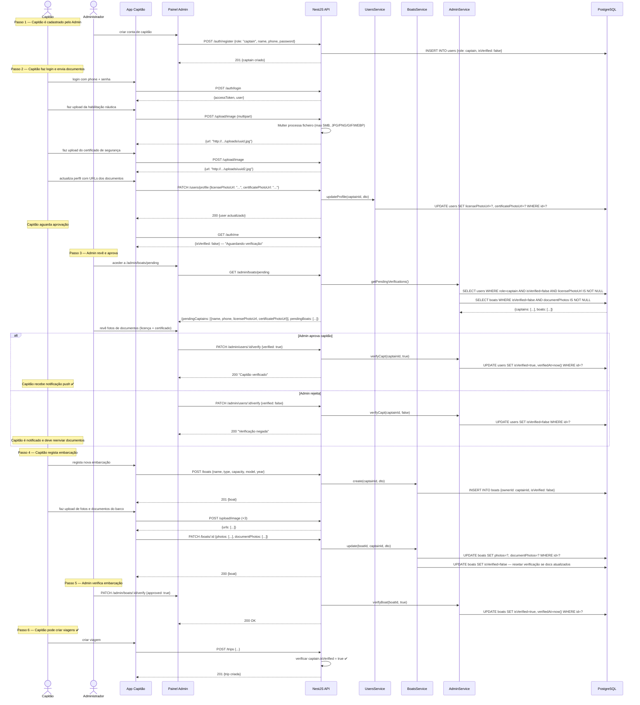
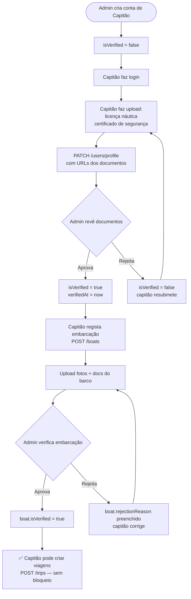

# SEQ07 — Diagrama de Sequência: Verificação de Capitão

## Fluxo Completo: Capitão → Verificação Admin → Criar Viagem

```mermaid
sequenceDiagram
  actor Captain as Capitão
  actor Admin as Administrador
  participant CaptApp as App Capitão
  participant AdminWeb as Painel Admin
  participant API as NestJS API
  participant UsersSvc as UsersService
  participant BoatsSvc as BoatsService
  participant AdminSvc as AdminService
  participant DB as PostgreSQL

  Note over Captain: Passo 1 — Capitão é cadastrado pelo Admin
  Admin->>AdminWeb: criar conta de capitão
  AdminWeb->>API: POST /auth/register {role: "captain", name, phone, password}
  API->>DB: INSERT INTO users {role: captain, isVerified: false}
  API-->>AdminWeb: 201 {captain criado}

  Note over Captain: Passo 2 — Capitão faz login e envia documentos
  Captain->>CaptApp: login com phone + senha
  CaptApp->>API: POST /auth/login
  API-->>CaptApp: {accessToken, user}

  Captain->>CaptApp: faz upload da habilitação náutica
  CaptApp->>API: POST /upload/image (multipart)
  API->>API: Multer processa ficheiro (max 5MB, JPG/PNG/GIF/WEBP)
  API-->>CaptApp: {url: "http://.../uploads/uuid.jpg"}

  Captain->>CaptApp: faz upload do certificado de segurança
  CaptApp->>API: POST /upload/image
  API-->>CaptApp: {url: "http://.../uploads/uuid2.jpg"}

  Captain->>CaptApp: actualiza perfil com URLs dos documentos
  CaptApp->>API: PATCH /users/profile {licensePhotoUrl: "...", certificatePhotoUrl: "..."}
  API->>UsersSvc: updateProfile(captainId, dto)
  UsersSvc->>DB: UPDATE users SET licensePhotoUrl=?, certificatePhotoUrl=? WHERE id=?
  API-->>CaptApp: 200 {user actualizado}

  Note over Captain: Capitão aguarda aprovação
  CaptApp->>API: GET /auth/me
  API-->>CaptApp: {isVerified: false} — "Aguardando verificação"

  Note over Admin: Passo 3 — Admin revê e aprova
  Admin->>AdminWeb: aceder a /admin/boats/pending
  AdminWeb->>API: GET /admin/boats/pending
  API->>AdminSvc: getPendingVerifications()
  AdminSvc->>DB: SELECT users WHERE role=captain AND isVerified=false AND licensePhotoUrl IS NOT NULL
  AdminSvc->>DB: SELECT boats WHERE isVerified=false AND documentPhotos IS NOT NULL
  DB-->>AdminSvc: {captains: [...], boats: [...]}
  API-->>AdminWeb: {pendingCaptains: [{name, phone, licensePhotoUrl, certificatePhotoUrl}], pendingBoats: [...]}

  Admin->>AdminWeb: revê fotos de documentos (licença + certificado)

  alt Admin aprova capitão
    AdminWeb->>API: PATCH /admin/users/:id/verify {verified: true}
    API->>AdminSvc: verifyCapt(captainId, true)
    AdminSvc->>DB: UPDATE users SET isVerified=true, verifiedAt=now() WHERE id=?
    API-->>AdminWeb: 200 "Capitão verificado"
    Note over Captain: Capitão recebe notificação push ✅
  else Admin rejeita
    AdminWeb->>API: PATCH /admin/users/:id/verify {verified: false}
    API->>AdminSvc: verifyCapt(captainId, false)
    AdminSvc->>DB: UPDATE users SET isVerified=false WHERE id=?
    API-->>AdminWeb: 200 "Verificação negada"
    Note over Captain: Capitão é notificado e deve reenviar documentos
  end

  Note over Captain: Passo 4 — Capitão regista embarcação
  Captain->>CaptApp: regista nova embarcação
  CaptApp->>API: POST /boats {name, type, capacity, model, year}
  API->>BoatsSvc: create(captainId, dto)
  BoatsSvc->>DB: INSERT INTO boats {ownerId: captainId, isVerified: false}
  API-->>CaptApp: 201 {boat}

  Captain->>CaptApp: faz upload de fotos e documentos do barco
  CaptApp->>API: POST /upload/image (×3)
  API-->>CaptApp: {urls: [...]}

  CaptApp->>API: PATCH /boats/:id {photos: [...], documentPhotos: [...]}
  API->>BoatsSvc: update(boatId, captainId, dto)
  BoatsSvc->>DB: UPDATE boats SET photos=?, documentPhotos=? WHERE id=?
  BoatsSvc->>DB: UPDATE boats SET isVerified=false — resetar verificação se docs atualizados
  API-->>CaptApp: 200 {boat}

  Note over Admin: Passo 5 — Admin verifica embarcação
  Admin->>AdminWeb: PATCH /admin/boats/:id/verify {approved: true}
  API->>AdminSvc: verifyBoat(boatId, true)
  AdminSvc->>DB: UPDATE boats SET isVerified=true, verifiedAt=now() WHERE id=?
  API-->>AdminWeb: 200 OK

  Note over Captain: Passo 6 — Capitão pode criar viagens ✅
  Captain->>CaptApp: criar viagem
  CaptApp->>API: POST /trips {...}
  API->>API: verificar captain.isVerified = true ✅
  API-->>CaptApp: 201 {trip criada}
```

---

## Diagrama de Actividade — Verificação

```mermaid
flowchart TD
  A([Admin cria conta de Capitão]) --> B[isVerified = false]
  B --> C[Capitão faz login]
  C --> D[Capitão faz upload:\nlicença náutica\ncertificado de segurança]
  D --> E[PATCH /users/profile\ncom URLs dos documentos]
  E --> F{Admin revê documentos}
  F -->|Aprova| G[isVerified = true\nverifiedAt = now]
  F -->|Rejeita| H[isVerified = false\ncapitão resubmete]
  H --> D

  G --> I[Capitão regista embarcação\nPOST /boats]
  I --> J[Upload fotos + docs do barco]
  J --> K{Admin verifica embarcação}
  K -->|Aprova| L[boat.isVerified = true]
  K -->|Rejeita| M[boat.rejectionReason preenchido\ncapitão corrige]
  M --> J

  L --> N[✅ Capitão pode criar viagens\nPOST /trips — sem bloqueio]
```
