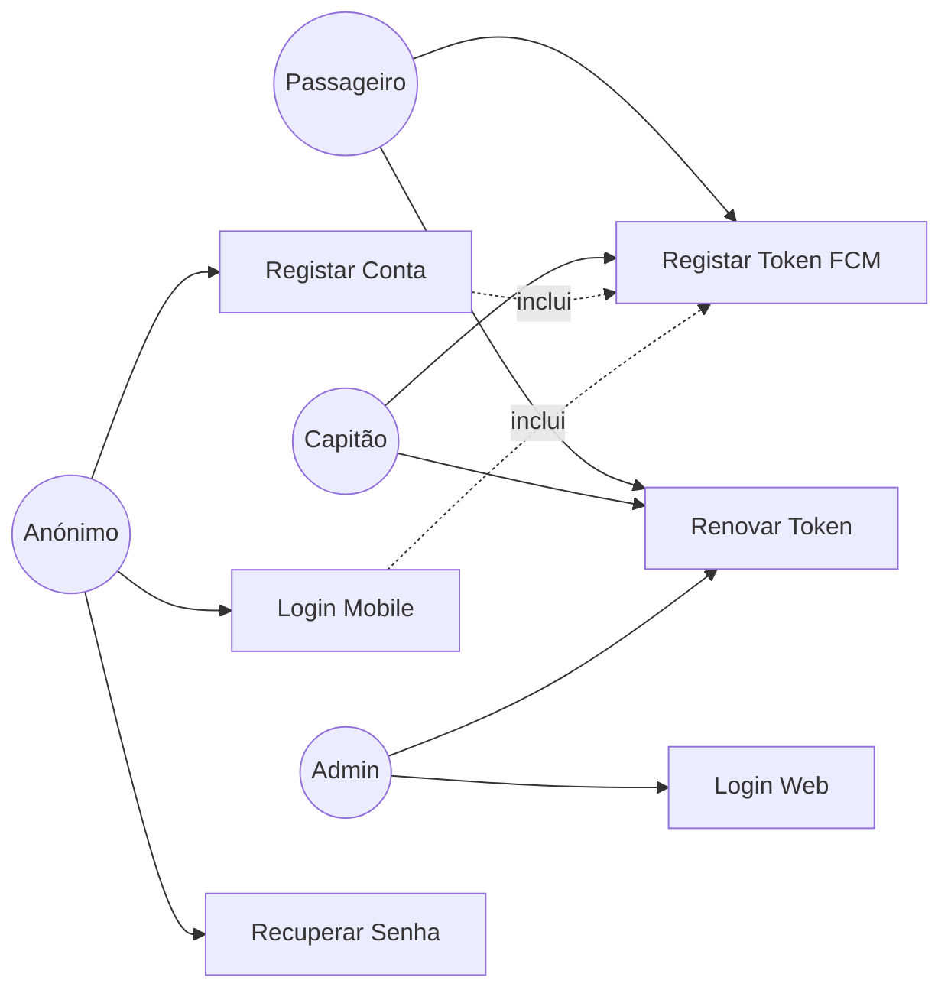

# UC01 — Autenticação e Gestão de Conta

## Actores
- **Passageiro** — utilizador final que reserva viagens
- **Capitão** — prestador de serviço fluvial (cadastrado pelo admin)
- **Administrador** — gestor da plataforma

---

## UC01.1 — Registar Conta (Passageiro)

| Campo | Valor |
|---|---|
| **Actor** | Utilizador anónimo |
| **Pré-condição** | Não tem conta. Role = passenger (único permitido via app) |
| **Trigger** | Utilizador preenche formulário de registo |

**Fluxo Principal:**
1. Utilizador envia `POST /auth/register` com `{name, phone, password, role: "passenger", city}`
2. Sistema valida que role ≠ captain/admin (403 caso contrário)
3. Sistema verifica que phone não existe na base de dados (409 se duplicado)
4. Sistema faz hash da senha com bcryptjs (10 rounds)
5. Sistema gera `referralCode` único (ex: `NVJ-A1B2C3`)
6. Sistema cria utilizador com `isActive: true`, `level: "Marinheiro"`, `rating: 5.0`
7. Sistema retorna `{accessToken, refreshToken, user}`

**Fluxos Alternativos:**
- `3a` — Phone duplicado → 409 Conflict
- `2a` — Role=captain → 403 "Capitães devem ser cadastrados pelo administrador"
- `1a` — Dados inválidos (phone mal formatado, senha curta) → 400 Bad Request

**Pós-condição:** Utilizador autenticado com JWT válido.

---

## UC01.2 — Login (App Mobile)

| Campo | Valor |
|---|---|
| **Actor** | Passageiro / Capitão |
| **Pré-condição** | Tem conta activa |
| **Trigger** | Utilizador insere telefone e senha |
| **Rate Limit** | 5 tentativas por minuto |

**Fluxo Principal:**
1. Utilizador envia `POST /auth/login` com `{phone, password}`
2. Sistema busca utilizador pelo phone
3. Sistema compara senha com bcryptjs hash
4. Sistema verifica `isActive = true`
5. Sistema gera `accessToken` (JWT, 15min) e `refreshToken` (JWT, 7 dias)
6. Retorna `{accessToken, refreshToken, user}` (sem passwordHash)

**Fluxos Alternativos:**
- `2a` — Phone não encontrado → 401 "Credenciais inválidas"
- `3a` — Senha errada → 401 "Credenciais inválidas"
- `4a` — Conta desactivada → 401 "Conta desactivada"
- `Rate limit` → 429 Too Many Requests

---

## UC01.3 — Login Web (Admin)

| Campo | Valor |
|---|---|
| **Actor** | Administrador |
| **Pré-condição** | Conta com role=admin |
| **Trigger** | Admin acede ao painel web |

**Fluxo Principal:**
1. Admin envia `POST /auth/login-web` com `{email, password}`
2. Sistema busca utilizador pelo email com role=admin
3. Sistema valida senha
4. Retorna tokens + perfil admin

**Fluxo Alternativo:**
- `2a` — Utilizador não é admin → 401

---

## UC01.4 — Renovar Token (Refresh)

| Campo | Valor |
|---|---|
| **Actor** | Qualquer utilizador autenticado |
| **Trigger** | Access token expirou (15min) |
| **Rate Limit** | 10 renovações por minuto |

**Fluxo Principal:**
1. App envia `POST /auth/refresh` com `{refreshToken}`
2. Sistema valida refreshToken (assinatura + expiração)
3. Sistema verifica que utilizador ainda está activo
4. Sistema gera novo par de tokens
5. Retorna `{accessToken, refreshToken}`

---

## UC01.5 — Recuperar Senha

| Campo | Valor |
|---|---|
| **Actor** | Qualquer utilizador |
| **Rate Limit** | 3 pedidos por minuto |

**Fluxo Principal:**
1. Utilizador envia `POST /auth/forgot-password` com `{email}`
2. Sistema gera código aleatório de 6 dígitos
3. Sistema define `resetCodeExpires` (15 minutos)
4. Sistema envia email com o código
5. Utilizador envia `POST /auth/reset-password` com `{email, code, newPassword}`
6. Sistema valida código e expiração
7. Sistema actualiza hash da senha e limpa o código
8. Retorna sucesso

**Fluxo Alternativo:**
- `6a` — Código expirado ou errado → 400 "Código inválido ou expirado"

---

## UC01.6 — Registar Token FCM (Push Notifications)

| Campo | Valor |
|---|---|
| **Actor** | Qualquer utilizador autenticado |
| **Trigger** | Após login no app, app envia token FCM |

**Fluxo Principal:**
1. App envia `POST /notifications/register-token` com `{fcmToken}` + JWT
2. Sistema associa token ao utilizador (`User.fcmToken`)
3. Partir deste momento, utilizador recebe notificações push

**Nota:** Ao fazer logout, app chama `DELETE /notifications/unregister-token` para remover o token.

---

## Diagrama de Casos de Uso — Autenticação

