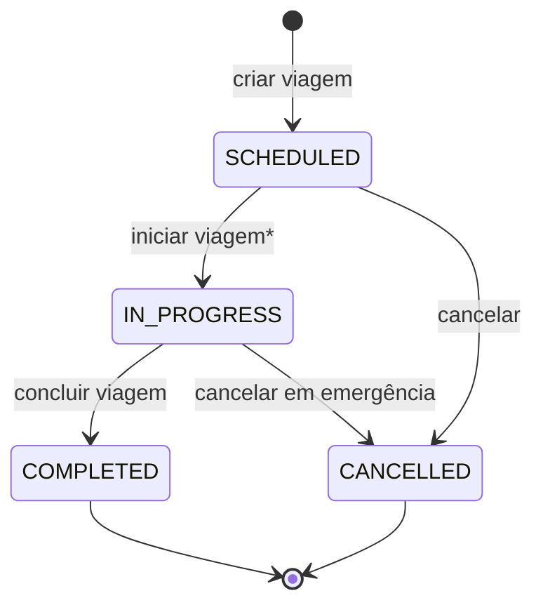
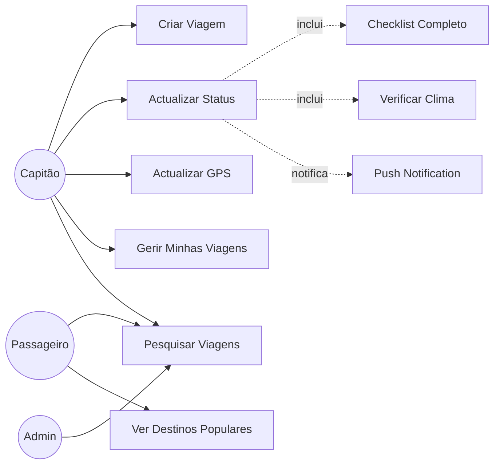

# UC02 — Gestão de Viagens

## Actores
- **Capitão** — cria e gere as suas viagens
- **Passageiro** — pesquisa e consulta viagens
- **Administrador** — supervisão e gestão administrativa

---

## UC02.1 — Criar Viagem

| Campo | Valor |
|---|---|
| **Actor** | Capitão verificado (`isVerified = true`) |
| **Pré-condição** | Capitão tem conta verificada pelo admin + embarcação registada |

**Fluxo Principal:**
1. Capitão envia `POST /trips` com dados da viagem
2. Sistema verifica que capitão está verificado (`isVerified`)
3. Sistema valida que `departureAt` é no futuro
4. Sistema valida que `estimatedArrivalAt > departureAt`
5. Sistema verifica que embarcação pertence ao capitão
6. Sistema verifica que `totalSeats ≤ boat.capacity`
7. Sistema verifica conflitos de horário (embarcação em outra viagem?)
8. Sistema verifica que `price > 0`
9. Sistema cria viagem com `status: SCHEDULED`, `availableSeats = totalSeats`
10. Retorna viagem criada

**Campos obrigatórios do DTO:**
- `origin` — nome do porto de partida
- `destination` — nome do porto de chegada
- `boatId` — UUID da embarcação
- `departureTime` — ISO datetime
- `arrivalTime` — ISO datetime
- `price` — preço por passageiro (decimal)
- `totalSeats` — número de lugares

**Campos opcionais:**
- `discount` — desconto em % (0-100)
- `cargoPriceKg` — preço por kg de encomenda
- `cargoCapacityKg` — capacidade de carga em kg

**Fluxos Alternativos:**
- `2a` — Capitão não verificado → 403 "Conta não verificada. Envie documentação."
- `5a` — Barco não pertence ao capitão → 404
- `6a` — Lugares excedem capacidade do barco → 400
- `7a` — Conflito de horário → 400 "Embarcação já tem viagem neste horário"
- `8a` — Preço ≤ 0 → 400

---

## UC02.2 — Pesquisar Viagens

| Campo | Valor |
|---|---|
| **Actor** | Passageiro / Capitão / Admin |
| **Pré-condição** | Autenticado |

**Fluxo Principal:**
1. Utilizador envia `GET /trips` com filtros opcionais
2. Sistema aplica filtros: status=SCHEDULED, data futura
3. Sistema retorna lista ordenada por data de partida

**Filtros disponíveis:**
| Parâmetro | Tipo | Exemplo |
|---|---|---|
| `origin` | string | "Manaus" |
| `destination` | string | "Manacapuru" |
| `date` | YYYY-MM-DD | "2026-03-01" |
| `minPrice` | integer | 30 |
| `maxPrice` | integer | 200 |
| `departureTime` | morning/afternoon/night | "morning" |
| `minRating` | integer (1-5) | 4 |

**Notas de implementação:**
- `origin`/`destination` → `LIKE %valor%` (case insensitive)
- `morning` → 06:00-11:59 | `afternoon` → 12:00-17:59 | `night` → 18:00-05:59
- Capitão retornado sem `passwordHash` ou `fcmToken`

---

## UC02.3 — Ver Destinos Populares

| Campo | Valor |
|---|---|
| **Actor** | Qualquer utilizador autenticado |
| **Endpoint** | `GET /trips/popular` |

**Fluxo Principal:**
1. Sistema agrega viagens com status=SCHEDULED
2. Retorna top 10 origens mais frequentes
3. Retorna top 10 destinos mais frequentes
4. Retorna top 10 rotas (origem+destino) com preço mínimo e médio

**Resposta:**
```json
{
  "origins": [{"city": "Manaus (Porto da Ceasa)", "tripsCount": 9}],
  "destinations": [{"city": "Manacapuru", "tripsCount": 3}],
  "routes": [{"origin": "...", "destination": "...", "tripsCount": 3, "minPrice": 35, "avgPrice": 40}]
}
```

---

## UC02.4 — Actualizar Status da Viagem

| Campo | Valor |
|---|---|
| **Actor** | Capitão (própria viagem) |
| **Pré-condição** | Viagem existe e pertence ao capitão |

**Transições de status permitidas:**



***Requisitos para iniciar viagem (SCHEDULED → IN_PROGRESS):**
1. Checklist de segurança completo (`allItemsChecked = true`)
2. Score climático ≥ 50/100 (API OpenWeatherMap)
   - Score < 50 → bloqueado (condições perigosas)
   - Score 50-70 → aviso mas permite
   - Score ≥ 70 → OK

**Efeitos ao mudar status:**
| Para | Efeito automático |
|---|---|
| `IN_PROGRESS` | Encomendas COLLECTED → IN_TRANSIT + notifica passageiros |
| `COMPLETED` | Reservas CONFIRMED/CHECKED_IN → COMPLETED + encomendas → ARRIVED + notifica |
| `CANCELLED` | Notifica passageiros |

---

## UC02.5 — Actualizar Localização GPS

| Campo | Valor |
|---|---|
| **Actor** | Capitão (viagem em andamento) |
| **Endpoint** | `PATCH /trips/:id/location` |

**Fluxo:**
1. App do capitão envia `{lat, lng}` periodicamente
2. Sistema actualiza `trip.currentLat` e `trip.currentLng`
3. Passageiros podem ver posição via `GET /bookings/:id/tracking`

---

## UC02.6 — Gerir as Minhas Viagens (Capitão)

| Endpoint | Acção |
|---|---|
| `GET /trips/captain/my-trips` | Lista todas as viagens do capitão |
| `PUT /trips/:id` | Actualiza dados da viagem (apenas status=SCHEDULED) |
| `DELETE /trips/:id` | Cancela (se há reservas) ou apaga (sem reservas) |

---

## Diagrama de Casos de Uso — Viagens


