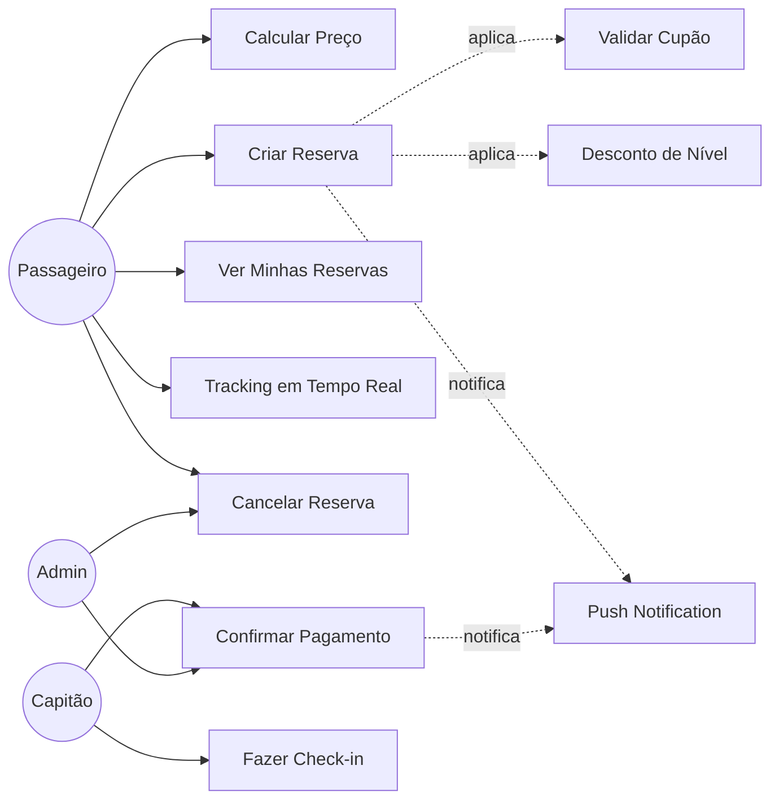
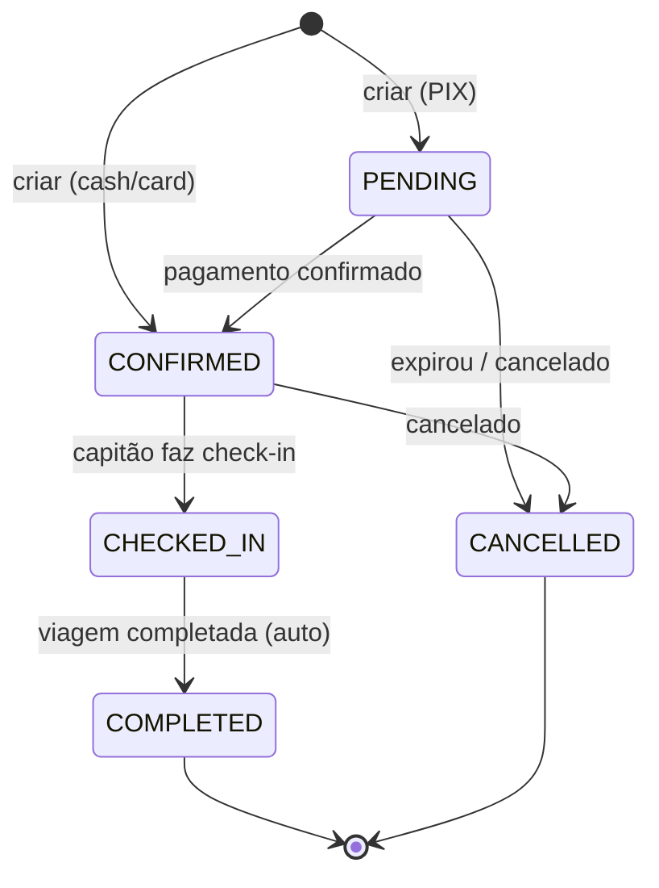

# UC03 — Reservas de Viagem

## Actores
- **Passageiro** — cria e gere as suas reservas
- **Capitão** — confirma pagamento e faz check-in de passageiros
- **Administrador** — supervisão e gestão

---

## UC03.1 — Calcular Preço Antes de Reservar

| Campo | Valor |
|---|---|
| **Actor** | Passageiro |
| **Endpoint** | `POST /bookings/calculate-price` |

**Fluxo Principal:**
1. Passageiro envia `{tripId, quantity, couponCode?}`
2. Sistema busca preço base da viagem
3. Sistema aplica desconto do cupão (se fornecido)
4. Sistema aplica desconto de nível de fidelização (Navegador/Capitão/Almirante)
5. Retorna preço detalhado antes de confirmar

**Resposta:**
```json
{
  "originalPrice": 90.00,
  "couponDiscount": 10.00,
  "loyaltyDiscount": 5.00,
  "finalPrice": 75.00
}
```

---

## UC03.2 — Criar Reserva

| Campo | Valor |
|---|---|
| **Actor** | Passageiro |
| **Pré-condição** | Viagem com `status=SCHEDULED` e `availableSeats ≥ quantity` |

**Fluxo Principal:**
1. Passageiro envia `POST /bookings` com `{tripId, quantity, paymentMethod, couponCode?}`
2. Sistema verifica disponibilidade de lugares
3. Sistema calcula preço final (com descontos)
4. Sistema gera QR code de check-in único
5. Sistema cria reserva com `status: CONFIRMED` (ou PENDING se PIX pendente)
6. Sistema decrementa `trip.availableSeats`
7. Notifica capitão via FCM
8. Retorna reserva com QR code

**Métodos de pagamento:**
- `cash` → reserva imediatamente CONFIRMED
- `pix` → gera QR code PIX, status fica PENDING até confirmação
- `credit_card` / `debit_card` → integração futura

**Fluxos Alternativos:**
- `2a` — Sem lugares disponíveis → 400 "Não há lugares suficientes"
- `2b` — Viagem não agendada → 400

---

## UC03.3 — Confirmar Pagamento PIX

| Campo | Valor |
|---|---|
| **Actor** | Capitão ou Admin |
| **Endpoint** | `POST /bookings/:id/confirm-payment` |

**Fluxo Principal:**
1. Capitão confirma recebimento do PIX manualmente
2. Sistema muda `paymentStatus: PAID` e `status: CONFIRMED`
3. Notifica passageiro via FCM

**Polling alternativo:**
- Passageiro pode chamar `GET /bookings/:id/payment-status` para verificar status

---

## UC03.4 — Check-in de Passageiro

| Campo | Valor |
|---|---|
| **Actor** | Capitão |
| **Pré-condição** | Reserva com status=CONFIRMED, viagem=IN_PROGRESS |

**Fluxo Principal:**
1. Passageiro apresenta QR code no embarque
2. Capitão lê QR via app e envia `POST /bookings/:id/checkin`
3. Sistema muda `status: CHECKED_IN` e regista `checkedInAt`
4. Retorna confirmação

---

## UC03.5 — Ver as Minhas Reservas

| Campo | Valor |
|---|---|
| **Actor** | Passageiro |
| **Endpoint** | `GET /bookings/my-bookings?status=confirmed` |

**Filtros disponíveis para `?status=`:**
- `pending` — aguardando pagamento
- `confirmed` — confirmada
- `checked_in` — embarcado
- `completed` — viagem concluída
- `cancelled` — cancelada
- `expired` — expirada

---

## UC03.6 — Tracking em Tempo Real

| Campo | Valor |
|---|---|
| **Actor** | Passageiro / Capitão / Admin |
| **Endpoint** | `GET /bookings/:id/tracking` |

**Resposta inclui:**
- Status actual da viagem
- Localização GPS actual (`currentLat`, `currentLng`)
- Número de passageiros embarcados
- Tempo estimado de chegada

---

## UC03.7 — Cancelar Reserva

| Campo | Valor |
|---|---|
| **Actor** | Passageiro (própria reserva) ou Admin |
| **Pré-condição** | Reserva não pode estar COMPLETED |

**Fluxo Principal:**
1. Passageiro envia `POST /bookings/:id/cancel`
2. Sistema muda `status: CANCELLED`
3. Sistema devolve os lugares ao trip (`availableSeats++`)
4. Se pagamento foi feito → `paymentStatus: REFUNDED` (processo manual)

---

## Diagrama de Casos de Uso — Reservas



---

## Ciclo de Vida de uma Reserva


