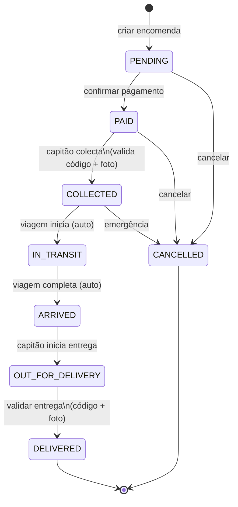

# UC04 — Encomendas (Shipments)

## Actores
- **Remetente** — passageiro ou capitão que envia encomenda
- **Capitão** — colecta e entrega a encomenda
- **Destinatário** — recebe a encomenda (não precisa de conta)

---

## UC04.1 — Calcular Preço de Encomenda

| Campo | Valor |
|---|---|
| **Actor** | Remetente autenticado |
| **Endpoint** | `POST /shipments/calculate-price` |

**Fluxo Principal:**
1. Remetente envia `{tripId, weight, length?, width?, height?}`
2. Sistema calcula peso volumétrico: `(L × W × H) / 5000`
3. Sistema usa o maior entre peso real e volumétrico
4. Sistema aplica `trip.cargoPriceKg` para calcular preço
5. Sistema aplica cupão (se fornecido)
6. Retorna breakdown detalhado

**Resposta:**
```json
{
  "originalPrice": 42.50,
  "volumetricWeight": 8.0,
  "volumetricPrice": 40.00,
  "weightPrice": 42.50,
  "totalPrice": 42.50,
  "discount": 5.00,
  "finalPrice": 37.50
}
```

---

## UC04.2 — Criar Encomenda

| Campo | Valor |
|---|---|
| **Actor** | Remetente autenticado |
| **Pré-condição** | Viagem tem `cargoPriceKg` configurado |

**Fluxo Principal:**
1. Remetente envia `POST /shipments` com dados
2. Sistema calcula preço (peso real vs volumétrico)
3. Sistema gera `trackingCode` único (ex: `NVJAM01234`)
4. Sistema gera `validationCode` de 6 dígitos (para validar entrega)
5. Sistema cria encomenda com `status: PENDING`
6. Notifica capitão via FCM
7. Retorna encomenda com tracking code

**Campos obrigatórios:**
- `tripId` — viagem em que será transportada
- `description` — descrição do conteúdo
- `weightKg` — peso em kg
- `recipientName`, `recipientPhone`, `recipientAddress`

**Campos opcionais:**
- `length`, `width`, `height` — para peso volumétrico
- `photos` — URLs de fotos (após upload via `/upload/image`)
- `paymentMethod` — pix (padrão), cash, credit_card
- `couponCode` — cupão de desconto

---

## UC04.3 — Confirmar Pagamento

| Campo | Valor |
|---|---|
| **Actor** | Remetente ou Capitão |
| **Endpoint** | `POST /shipments/:id/confirm-payment` |

**Fluxo:**
1. Pagamento confirmado manualmente
2. `status` → PAID
3. Encomenda pronta para colecta pelo capitão

---

## UC04.4 — Capitão Colecta Encomenda

| Campo | Valor |
|---|---|
| **Actor** | Capitão da viagem |
| **Endpoint** | `POST /shipments/:id/collect` |

**Fluxo Principal:**
1. Capitão recebe encomenda do remetente no porto
2. Capitão envia `{validationCode, collectionPhotoUrl}`
3. Sistema valida o código de 6 dígitos
4. Sistema regista foto de colecta
5. `status` → COLLECTED
6. Regista evento no timeline

**Fluxo Alternativo:**
- `3a` — Código errado → 400 "Código de validação inválido"

---

## UC04.5 — Rastrear Encomenda (Público)

| Campo | Valor |
|---|---|
| **Actor** | Qualquer pessoa (sem autenticação) |
| **Endpoint** | `GET /shipments/track/:trackingCode` |

**Fluxo:**
1. Destinatário insere tracking code
2. Sistema retorna status actual + timeline de eventos
3. Se `status=OUT_FOR_DELIVERY`, mostra localização GPS do capitão

---

## UC04.6 — Entregar Encomenda

**Passo 1 — Capitão marca "em entrega":**
- `POST /shipments/:id/out-for-delivery`
- `status` → OUT_FOR_DELIVERY

**Passo 2 — Validação final na entrega:**
- `POST /shipments/validate-delivery` (público) com `{trackingCode, validationCode, deliveryPhotoUrl}`
- Sistema valida código
- `status` → DELIVERED
- Regista foto de entrega + `deliveredAt`
- Sistema atribui pontos ao remetente (`GamificationService.awardPoints`)

---

## UC04.7 — Ver as Minhas Encomendas

| Campo | Valor |
|---|---|
| **Endpoint** | `GET /shipments/my-shipments` |
| **Actor** | Remetente autenticado |

Retorna todas as encomendas enviadas pelo utilizador logado.

---

## UC04.8 — Avaliar Serviço de Encomenda

| Campo | Valor |
|---|---|
| **Actor** | Remetente (após entrega) |
| **Endpoint** | `POST /shipments/reviews` |

**DTO:**
```json
{
  "shipmentId": "uuid",
  "rating": 5,
  "deliveryQuality": 4,
  "timeliness": 5,
  "comment": "Entrega rápida e cuidadosa!"
}
```

---

## Ciclo de Vida de uma Encomenda



---

## Timeline de Eventos

Cada mudança de status gera um evento em `shipment_timeline`:

| Status | Evento no Timeline |
|---|---|
| PENDING | "Encomenda registada" |
| PAID | "Pagamento confirmado" |
| COLLECTED | "Colectada pelo capitão em [porto]" |
| IN_TRANSIT | "Em trânsito para [destino]" |
| ARRIVED | "Chegou ao destino" |
| OUT_FOR_DELIVERY | "Saiu para entrega" |
| DELIVERED | "Entregue a [recipiente]" |
| CANCELLED | "Cancelada" |
