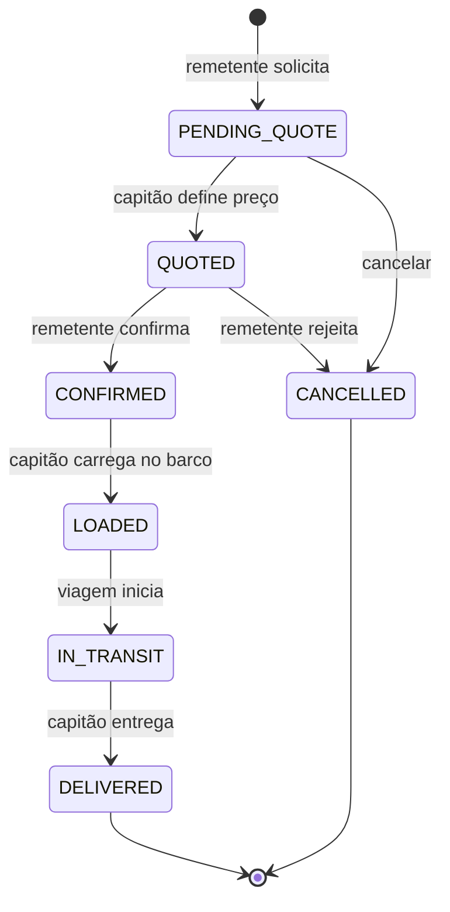

# UC05 — Carga (Cargo Shipments)

## Actores
- **Remetente** — solicita transporte de carga volumosa/especial
- **Capitão** — orça o preço e transporta a carga

---

## Tipos de Carga Suportados

| Tipo | Preço de Referência |
|---|---|
| `motorcycle` — Motocicleta | R$ 150,00 |
| `car` — Automóvel | R$ 500,00 |
| `pickup_truck` — Camionete | R$ 650,00 |
| `rancho` — Rancho/Mercadoria | R$ 200,00 |
| `construction` — Material de construção | R$ 180,00 |
| `fuel` — Combustível | R$ 80,00 |
| `livestock` — Gado/animais | R$ 60,00 |
| `electronics` — Electrónicos | R$ 100,00 |
| `general` — Geral | R$ 150,00 |

---

## UC05.1 — Consultar Tipos de Carga e Preços

| Campo | Valor |
|---|---|
| **Actor** | Qualquer um (público) |
| **Endpoint** | `GET /cargo/types` |

Retorna lista de tipos com preços de referência. Estes são preços base; o capitão define o preço final.

---

## UC05.2 — Solicitar Transporte de Carga

| Campo | Valor |
|---|---|
| **Actor** | Remetente autenticado |
| **Pré-condição** | Viagem disponível com capacidade de carga |

**Fluxo Principal:**
1. Remetente envia `POST /cargo` com dados
2. Sistema cria pedido com `status: PENDING_QUOTE`
3. Capitão recebe notificação
4. Aguarda cotação do capitão

**DTO:**
```json
{
  "tripId": "uuid",
  "cargoType": "motorcycle",
  "description": "Honda CG 160 2022, com tanque vazio",
  "quantity": 1,
  "estimatedWeightKg": 120,
  "receiverName": "João Silva",
  "receiverPhone": "92991234567",
  "notes": "Cuidado com o espelho retrovisor"
}
```

---

## UC05.3 — Capitão Coteja Carga

| Campo | Valor |
|---|---|
| **Actor** | Capitão da viagem |
| **Endpoint** | `PATCH /cargo/:id/quote` |

**Fluxo:**
1. Capitão visualiza pedido via `GET /cargo/trip/:tripId`
2. Capitão define `totalPrice`
3. `status` → QUOTED
4. Remetente recebe notificação com preço

---

## UC05.4 — Remetente Confirma Cotação

| Campo | Valor |
|---|---|
| **Actor** | Remetente |
| **Endpoint** | `PATCH /cargo/:id/confirm` |

**Fluxo:**
1. Remetente vê preço cotado
2. Confirma → `status: CONFIRMED`
3. (rejeita → cancela o pedido)

---

## UC05.5 — Acompanhar Transporte de Carga

| Campo | Valor |
|---|---|
| **Actor** | Remetente (autenticado) ou Destinatário (tracking code) |
| **Endpoint** | `GET /cargo/track/:trackingCode` (público) |

---

## Ciclo de Vida de uma Carga



---

## Diferença: Cargo vs Shipment

| Aspecto | Cargo (Carga) | Shipment (Encomenda) |
|---|---|---|
| **Tamanho** | Grande (motos, carros, gado) | Pequeno (caixas, volumes) |
| **Preço** | Definido pelo capitão (cotação) | Calculado por kg (automático) |
| **Tracking** | Código gerado | Código gerado + timeline detalhado |
| **Validação entrega** | Foto do capitão | Código 6 dígitos + foto |
| **Fotos** | 1 foto (optional) | Múltiplas fotos |
