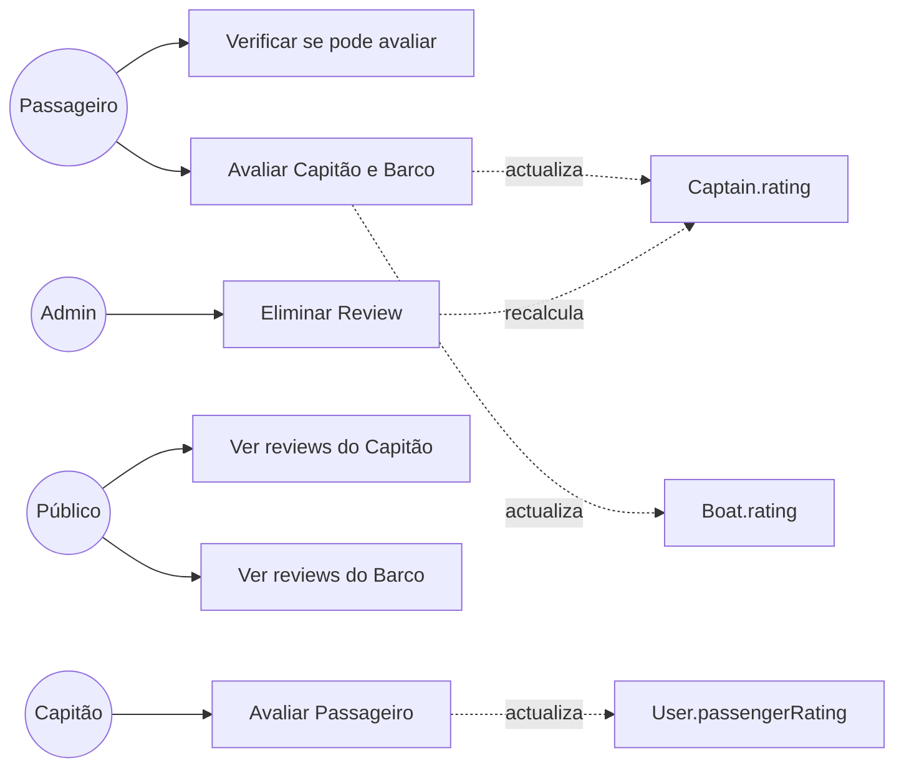

# UC06 — Sistema de Avaliações

## Actores
- **Passageiro** — avalia capitão e barco após a viagem
- **Capitão** — avalia passageiro após a viagem
- **Público** — consulta avaliações sem autenticação

---

## Regras de Negócio Fundamentais

1. **Só após viagem completa** — `trip.status = COMPLETED` e `booking.status = COMPLETED`
2. **Uma review por tipo** — constraint UNIQUE `(reviewerId, tripId, reviewType)`
3. **Passageiro avalia capitão E barco** — numa só operação
4. **Ratings actualizados automaticamente** — médias recalculadas após cada review
5. **Admin pode eliminar** — com recálculo automático das médias

---

## UC06.1 — Verificar se Pode Avaliar

| Campo | Valor |
|---|---|
| **Actor** | Passageiro ou Capitão autenticado |
| **Endpoint** | `GET /reviews/can-review/:tripId` |

**Fluxo:**
1. Sistema verifica `trip.status = COMPLETED`
2. Sistema verifica que o utilizador teve uma reserva COMPLETED na viagem
3. Sistema verifica que ainda não submeteu review deste tipo nesta viagem
4. Retorna `{canReview: true/false, reason?: "..."}`

---

## UC06.2 — Passageiro Avalia Capitão e Barco

| Campo | Valor |
|---|---|
| **Actor** | Passageiro |
| **Endpoint** | `POST /reviews` |
| **Pré-condição** | `canReview = true` |

**Fluxo Principal:**
1. Passageiro envia review com notas e comentários
2. Sistema valida elegibilidade (viagem completa + reserva completa)
3. Sistema cria registo com `reviewType: PASSENGER_TO_CAPTAIN`
4. Sistema recalcula `captain.rating` (média de todos os `captainRating`)
5. Sistema recalcula `boat.rating` (média de todos os `boatRating`)
6. Sistema atribui 5 pontos de gamificação ao passageiro

**DTO completo:**
```json
{
  "tripId": "uuid",
  "captainRating": 5,
  "captainComment": "Muito atencioso e pontual!",
  "punctualityRating": 5,
  "communicationRating": 4,
  "boatRating": 4,
  "boatComment": "Barco limpo e confortável.",
  "cleanlinessRating": 5,
  "comfortRating": 4,
  "boatPhotos": ["http://.../foto1.jpg"]
}
```

**Campos opcionais:** todos os `*Rating` secundários + comentários + fotos

---

## UC06.3 — Capitão Avalia Passageiro

| Campo | Valor |
|---|---|
| **Actor** | Capitão |
| **Endpoint** | `POST /reviews/captain-review` |
| **Pré-condição** | Viagem completa, passageiro embarcou |

**Fluxo:**
1. Capitão envia avaliação do passageiro
2. Sistema cria registo com `reviewType: CAPTAIN_TO_PASSENGER`
3. Sistema recalcula `passenger.passengerRating`

**DTO:**
```json
{
  "tripId": "uuid",
  "passengerId": "uuid",
  "passengerRating": 5,
  "passengerComment": "Passageiro pontual e respeitoso."
}
```

---

## UC06.4 — Consultar Avaliações (Público)

| Endpoint | Retorna |
|---|---|
| `GET /reviews/captain/:captainId` | Reviews do capitão com estatísticas (media, distribuição por estrela) |
| `GET /reviews/boat/:boatId` | Reviews do barco com estatísticas |
| `GET /reviews/passenger/:passengerId` | Reviews do passageiro |
| `GET /reviews/trip/:tripId` | Todas as reviews de uma viagem |
| `GET /reviews/my` | Reviews que o utilizador logado escreveu |

**Estatísticas retornadas (capitão/barco):**
```json
{
  "averageRating": 4.7,
  "totalReviews": 23,
  "distribution": {"5": 18, "4": 4, "3": 1, "2": 0, "1": 0},
  "reviews": [...]
}
```

---

## Diagrama de Casos de Uso — Avaliações


