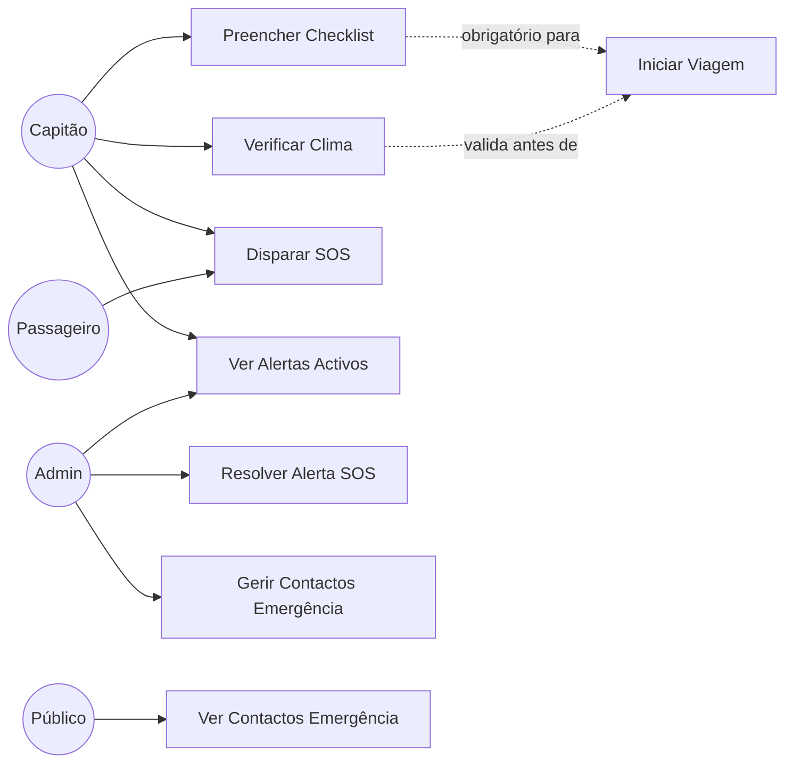

# UC07 — Segurança e Emergências

## Actores
- **Capitão** — preenche checklist antes de partir
- **Utilizador** — pode disparar alertas SOS
- **Admin** — gere contactos de emergência, resolve alertas
- **Público** — consulta contactos de emergência

---

## UC07.1 — Checklist de Segurança

| Campo | Valor |
|---|---|
| **Actor** | Capitão |
| **Pré-condição** | Viagem com status=SCHEDULED |
| **Obrigatoriedade** | Viagem BLOQUEADA se checklist incompleto |

**Itens do Checklist:**

| Item | Campo | Tipo |
|---|---|---|
| Coletes salva-vidas disponíveis | `lifeJacketsAvailable` | boolean |
| Quantidade de coletes | `lifeJacketsCount` | number |
| Extintor de incêndio verificado | `fireExtinguisherCheck` | boolean |
| Condições climáticas OK | `weatherConditionsOk` | boolean |
| Condição climática observada | `weatherCondition` | string |
| Estado do barco OK | `boatConditionGood` | boolean |
| Equipamentos de emergência OK | `emergencyEquipmentCheck` | boolean |
| Luzes de navegação funcionando | `navigationLightsWorking` | boolean |
| Capacidade máxima respeitada | `maxCapacityRespected` | boolean |
| Passageiros a bordo | `passengersOnBoard` | number |
| Capacidade máxima | `maxCapacity` | number |
| Observações | `observations` | text |

**Fluxo Principal:**
1. Capitão cria checklist via `POST /safety/checklists` com `{tripId}`
2. Capitão preenche itens via `PATCH /safety/checklists/:id`
3. Quando todos os campos boolean = true → `allItemsChecked = true`
4. Capitão pode iniciar viagem

**Verificação automática:**
- `GET /safety/checklists/trip/:id/status` retorna `{complete: true/false, missingItems: [...]}`
- Ao tentar iniciar viagem sem checklist → 400 "Checklist de segurança não está completo"

---

## UC07.2 — Verificação Climática

| Campo | Valor |
|---|---|
| **Actor** | Capitão / Admin |
| **Endpoints** | `GET /safety/weather-suggestion` e `GET /safety/weather-safety` |

**Fluxo:**
1. Capitão consulta condições climáticas actuais
2. Sistema chama OpenWeatherMap API para coordenadas da viagem
3. Sistema calcula score de segurança 0-100

**Score de Segurança:**

| Score | Classificação | Acção |
|---|---|---|
| < 50 | 🔴 PERIGOSO | Viagem BLOQUEADA |
| 50-70 | 🟡 CAUTELA | Aviso + permite |
| ≥ 70 | 🟢 FAVORÁVEL | OK para navegar |

**Factores avaliados:**
- Velocidade do vento (> 15 m/s = perigoso)
- Precipitação (> 10mm/h = perigoso)
- Visibilidade (< 1000m = perigoso)
- Condição geral (thunderstorm, tornado = perigoso)

---

## UC07.3 — Alerta SOS

| Campo | Valor |
|---|---|
| **Actor** | Passageiro ou Capitão em viagem |
| **Endpoint** | `POST /safety/sos` |

**Tipos de Alerta:**
- `emergency` — emergência geral
- `medical` — emergência médica
- `fire` — incêndio
- `water_leak` — embarque de água
- `mechanical` — avaria mecânica
- `weather` — condições climáticas perigosas
- `accident` — acidente
- `other` — outro

**Fluxo Principal:**
1. Utilizador envia alerta com `{type, description, latitude, longitude}`
2. Sistema cria alerta com `status: ACTIVE`
3. Admins e capitães podem ver alertas activos via `GET /safety/sos/active`
4. Admin resolve via `PATCH /safety/sos/:id/resolve` com `{status, notes}`
   - `status` pode ser: `resolved`, `false_alarm`, `cancelled`

---

## UC07.4 — Contactos de Emergência

| Campo | Valor |
|---|---|
| **Actor** | Público (leitura) / Admin (gestão) |
| **Endpoint** | `GET /safety/emergency-contacts?region=Manaus` |

**Contactos pré-cadastrados para Manaus:**
- Capitania dos Portos (Marinha)
- Corpo de Bombeiros
- Polícia Militar
- SAMU
- Defesa Civil
- Guarda Portuária

---

## Diagrama de Casos de Uso — Segurança

