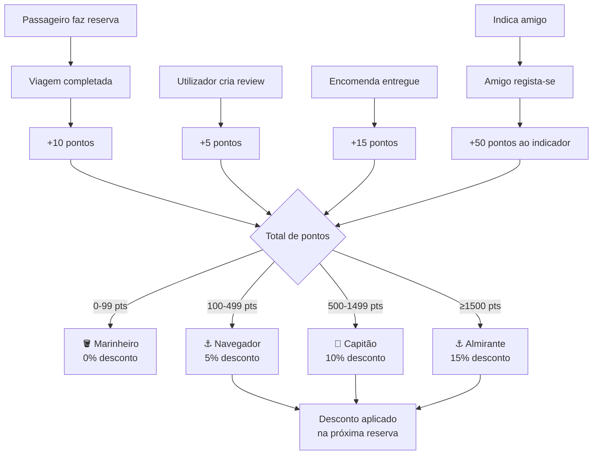

# UC08 — Gamificação e Fidelização

## Actores
- **Passageiro / Remetente** — acumula pontos por acções
- **Capitão** — também acumula pontos (encomendas entregues)
- **Convidado** — indicado por um utilizador existente

---

## Sistema de Pontos

| Acção | Pontos |
|---|---|
| Viagem completa (booking_completed) | +10 pts |
| Encomenda entregue (shipment_delivered) | +15 pts |
| Carga entregue (cargo_delivered) | +15 pts |
| Review criada (review_created) | +5 pts |
| Primeira viagem do mês (first_trip_month) | +20 pts |
| Indicar um amigo (referral) | +50 pts |

---

## Níveis de Fidelização

| Nível | Mínimo de Pontos | Desconto |
|---|---|---|
| 🪣 Marinheiro | 0 pts | 0% |
| ⚓ Navegador | 100 pts | 5% |
| 🧭 Capitão | 500 pts | 10% |
| ⚓ Almirante | 1500 pts | 15% |

O nível é actualizado automaticamente quando os pontos mudam.

---

## UC08.1 — Ver Estatísticas de Gamificação

| Campo | Valor |
|---|---|
| **Endpoint** | `GET /gamification/stats` |
| **Actor** | Qualquer utilizador autenticado |

**Resposta:**
```json
{
  "points": 350,
  "level": "Navegador",
  "discount": 5,
  "nextLevel": "Capitão",
  "pointsToNextLevel": 150
}
```

---

## UC08.2 — Ver Histórico de Pontos

| Campo | Valor |
|---|---|
| **Endpoint** | `GET /gamification/history?page=1&limit=20` |
| **Actor** | Utilizador autenticado |

Retorna lista paginada de todas as transações de pontos com data e descrição.

---

## UC08.3 — Leaderboard

| Campo | Valor |
|---|---|
| **Endpoint** | `GET /gamification/leaderboard` |
| **Actor** | Utilizador autenticado |

Retorna top utilizadores por total de pontos.

---

## UC08.4 — Referral (Indicar Amigos)

**Fluxo:**
1. Utilizador partilha o seu `referralCode` (ex: `NVJ-A1B2C3`)
2. Novo utilizador regista-se com `{..., referralCode: "NVJ-A1B2C3"}`
3. Após registo bem-sucedido, `GamificationService.processReferral()` é chamado
4. Utilizador original recebe +50 pontos

---

## UC08.5 — Aplicar Desconto de Nível na Reserva

**Fluxo automático na criação de reserva:**
1. Sistema verifica nível do passageiro
2. Calcula desconto aplicável (5%, 10% ou 15%)
3. Aplica ao preço final da reserva
4. Visível em `POST /bookings/calculate-price`

---

## Diagrama de Fluxo de Pontos


