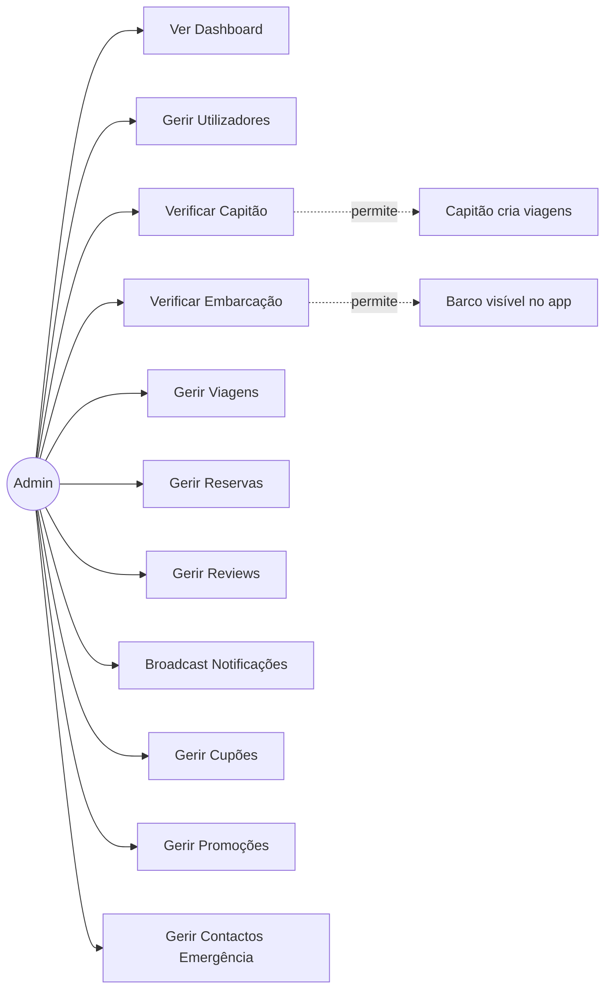

# UC09 — Administração da Plataforma

## Actor: Administrador

Todos os endpoints `/admin/*` requerem JWT com `role = admin`.

---

## UC09.1 — Dashboard

| Campo | Valor |
|---|---|
| **Endpoint** | `GET /admin/dashboard` |

**Métricas retornadas:**
```json
{
  "users": { "total": 150, "passengers": 120, "captains": 29, "admins": 1, "newThisMonth": 12 },
  "trips": { "total": 45, "scheduled": 20, "inProgress": 3, "completed": 18, "cancelled": 4 },
  "bookings": { "total": 320, "confirmed": 45, "completed": 260, "cancelled": 15 },
  "shipments": { "total": 85, "pending": 5, "inTransit": 8, "delivered": 70 },
  "revenue": { "totalTrips": 12500.00, "totalShipments": 3200.00, "total": 15700.00 },
  "pendingVerifications": { "boats": 3, "captains": 2 }
}
```

**Gráfico:** `GET /admin/dashboard/chart?days=30`
- Receita diária, reservas diárias, novos utilizadores

**Actividade recente:** `GET /admin/dashboard/activity`
- Últimas 50 acções do sistema (reservas, encomendas, SOS, etc.)

---

## UC09.2 — Gestão de Utilizadores

| Endpoint | Acção |
|---|---|
| `GET /admin/users?role=captain&search=João&page=1` | Listar utilizadores |
| `GET /admin/users/stats` | Estatísticas por role |
| `GET /admin/users/:id` | Detalhes completos |
| `PATCH /admin/users/:id/role` | Mudar role (ex: passenger → captain) |
| `PATCH /admin/users/:id/status` | Activar/desactivar conta |
| `DELETE /admin/users/:id` | Eliminar permanentemente |

---

## UC09.3 — Verificar Capitão

| Campo | Valor |
|---|---|
| **Endpoint** | `PATCH /admin/users/:id/verify` |
| **Pré-condição** | Capitão enviou `licensePhotoUrl` e `certificatePhotoUrl` |

**Fluxo:**
1. Admin acede a `/admin/boats/pending` para ver pendentes
2. Admin revê documentos do capitão (foto da habilitação náutica + certificado)
3. Admin aprova → `PATCH /admin/users/:id/verify` com `{verified: true}`
   - `User.isVerified = true`
   - `User.verifiedAt = now()`
4. Capitão pode agora criar viagens
5. Se reprovar → `{verified: false}` → capitão precisa de reenviar documentos

---

## UC09.4 — Verificar Embarcação

| Campo | Valor |
|---|---|
| **Endpoint** | `PATCH /admin/boats/:id/verify` |
| **Lista de pendentes** | `GET /admin/boats/pending` |

**Fluxo:**
1. Admin vê embarcações aguardando verificação
2. Admin revê fotos de documentos (`boat.documentPhotos`)
3. Aprovar → `{approved: true}` → `Boat.isVerified = true`
4. Reprovar → `{approved: false, rejectionReason: "..."}` → `Boat.rejectionReason` preenchido

**Nota:** Se capitão actualizar documentos do barco, `isVerified` volta a false (requer nova aprovação).

---

## UC09.5 — Gestão de Viagens

| Endpoint | Acção |
|---|---|
| `GET /admin/trips?status=scheduled&page=1` | Listar viagens |
| `GET /admin/trips/stats` | Estatísticas |
| `PATCH /admin/trips/:id/status` | Forçar mudança de status |
| `DELETE /admin/trips/:id` | Eliminar viagem |

---

## UC09.6 — Gestão de Reservas

| Endpoint | Acção |
|---|---|
| `GET /admin/bookings?status=confirmed&paymentStatus=pending` | Listar reservas |
| `GET /admin/bookings/stats` | Estatísticas e receita |
| `GET /admin/bookings/:id` | Detalhes |
| `PATCH /admin/bookings/:id/status` | Forçar status |
| `DELETE /admin/bookings/:id` | Eliminar |

---

## UC09.7 — Gestão de Reviews

| Endpoint | Acção |
|---|---|
| `GET /admin/reviews?type=passenger_to_captain` | Listar reviews |
| `GET /admin/reviews/stats` | Estatísticas |
| `DELETE /admin/reviews/:id` | Eliminar + recalcular médias |

**Ao eliminar:** sistema recalcula automaticamente `captain.rating` e `boat.rating`.

---

## UC09.8 — Broadcast de Notificações

| Campo | Valor |
|---|---|
| **Endpoint** | `POST /admin/notifications/broadcast` |

**Payload:**
```json
{
  "title": "Promoção de Carnaval! 🎉",
  "body": "20% de desconto em todas as viagens este fim-de-semana.",
  "data": {"type": "promotion", "url": "/trips"},
  "filter": {
    "cities": ["Manaus", "Manacapuru"],
    "roles": ["passenger"]
  }
}
```

Envia notificação push via FCM para todos os utilizadores que correspondem aos filtros e têm `fcmToken` registado.

---

## Diagrama de Casos de Uso — Administração


